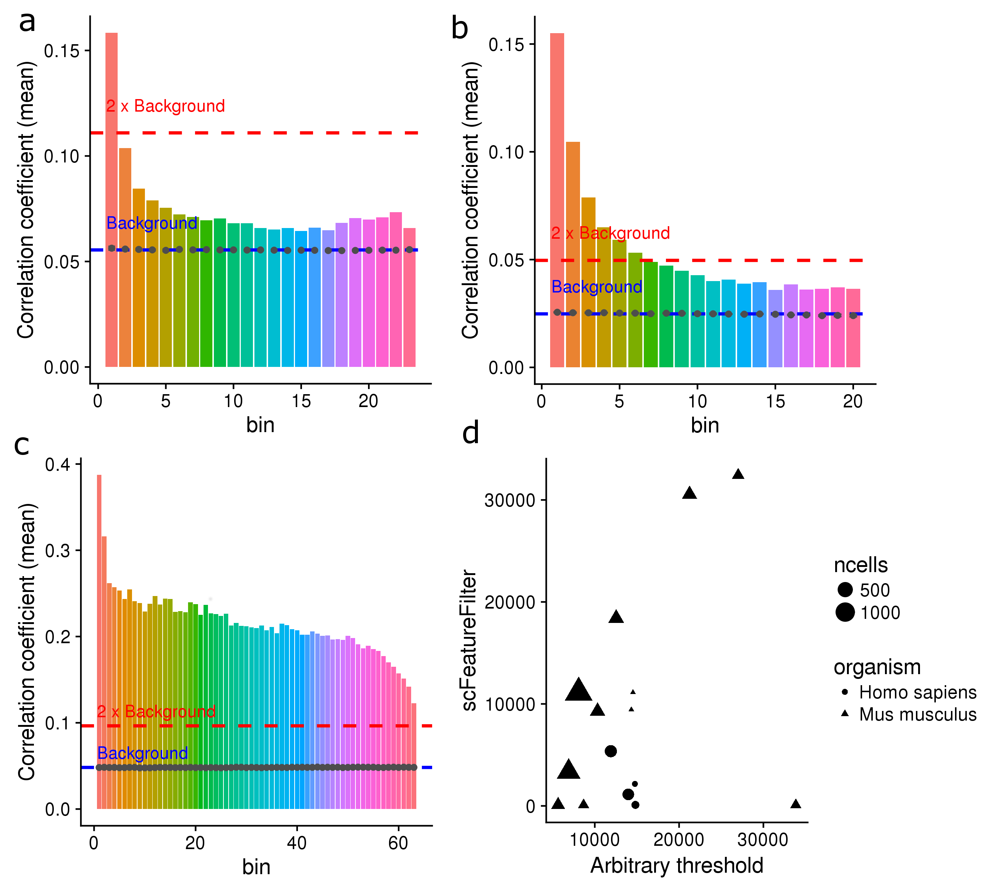
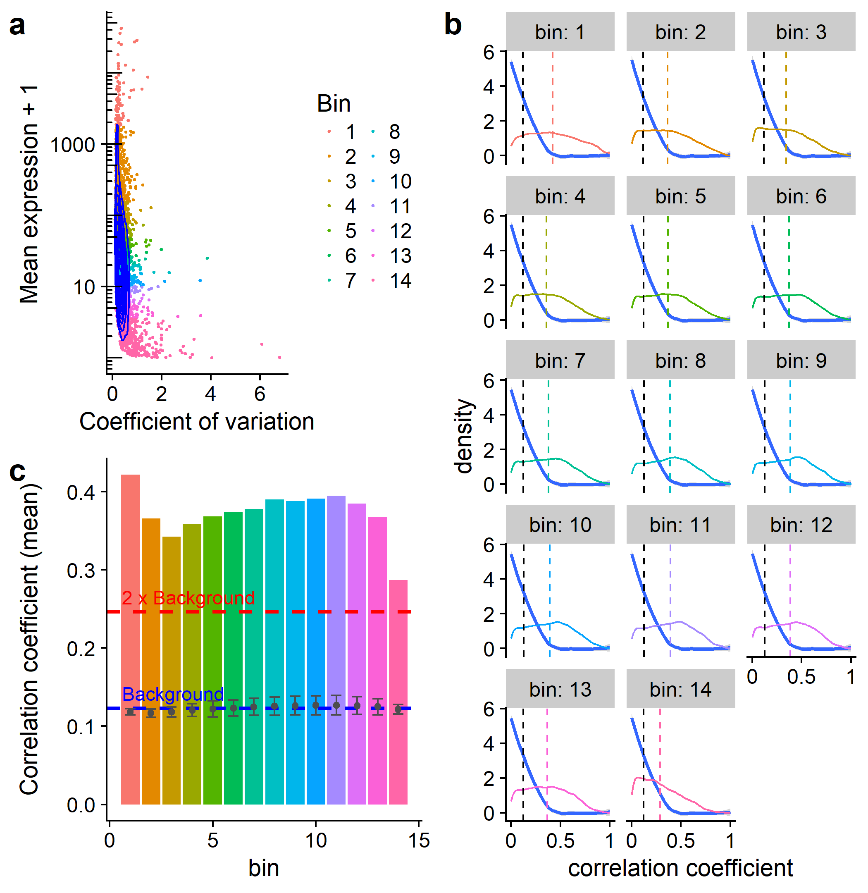

```{r setup, include=FALSE, cache=FALSE}
options(htmltools.dir.version = FALSE, servr.daemon = TRUE)
library(tidyverse)
library(cowplot)
library(knitr)
opts_chunk$set(cache = TRUE, cache.lazy = FALSE, collapse=TRUE, fig.align="center")
```


# Introduction

- Single cell RNA-sequencing is increasingly popular.

- scRNA-seq is noisier than bulk RNA-seq.

- Filtering of noisy, lowly-expressed features.red[*] is common.

.footnote[.red[*]Feature: gene or transcript]

---

## Introduction
- Using spike-in RNA information

- Arbitrary filtering:

>.small[[...] on a filtered data set, where we retain only genes with an estimated
TPM above 1 in more than 25% of the considered cells. (1)]
 
>.small[Genes with less than 5 reads and expressed in
less than 10 cells were removed. (2)] 
 
>.small[Here, low-abundance genes are defined as those 
with an average count below a filter threshold of 1 [count]. (3)] 
 
>.small[ Genes were filtered, keeping 15,633 out of 26,178 genes
that were expressed in at least 5 out of 1,919 sequenced cells (RPKM 
≥ 10) and for which cells with expression came from at least 
two different embryos. (4)]

.tiny[.red[1] Soneson & Robinson, bioRxiv, 2017  
.red[2] Stevant et al., bioRxiv, 2017  
.red[3] Lun et al., F1000Research, 2016  
.red[4] Petropulos et al., Cell, 2016]

---

## Introduction

- No standard threshold for filtering.

- Same threshold might not be of the *same stringency*
in different datasets, notably across species.red[*].

.footnote[.red[*] See Mansoki et al., Comput Biol Chem., 2016]

* Can we do better?

---

class: inverse
# scFeatureFilter
- R package

- Available on GitHub:  
[github.com/gdevailly/scFeatureFilter](https://github.com/gdevailly/scFeatureFilter)

- Accepted in [Bioconductor](https://www.bioconductor.org/packages/devel/bioc/html/scFeatureFilter.html)

.footnote[Need R ≥ 3.5 (*or edit DESCRIPTION to depends: R ≥ 3.4*)]

- Might help to set a relevant expression threshold for feature filtering.

```{r loadingLibrary, cache=FALSE}
library(scFeatureFilter)
```

---

## Example datasets:
32 scRNA-seq of human embryonic stem cells .small[(Yan et al., Nat Struct Mol Biol, 2013.)]
```{r dimScData}
dim(scData_hESC)
```
```{r dummyChunk, eval=FALSE, echo=FALSE, cache=FALSE}
mt <- scData_hESC[1:6, 1:5]
colnames(mt) <- c("gene", "cell_1", "cell_2", "cell_3", "cell_4")
knitr::kable(mt, format = "markdown", digits = 2)
```
```{r glimpseScData, eval=FALSE, cache=FALSE}
scData_hESC
```

.small[
|gene               | cell_1| cell_2| cell_3| cell_4|
|:------------------|------:|------:|------:|------:|
|ENSG00000000003.13 |  55.33|  35.98|  53.68|  31.95|
|ENSG00000000005.5  |   0.00|   0.00|   0.13|   0.00|
|ENSG00000000419.11 |  53.97|  55.47|  41.87| 110.75|
|ENSG00000000457.12 |   0.92|   0.22|   0.65|   0.87|
]

.small[Expression matrices can  be either `data.frame`, `tibble`, `matrix` or `SingleCellExperiment`.]

---

## Mean-variance exploration:
```{r meanVar0}
calculate_cvs(scData_hESC, max_zeros = 0.75)[1:4, 1:5]

```
`max_zeros`: maximum proportion of `0` value for a feature to be kept

---

## Mean-variance exploration:
```{r meanVar1, fig.height=4, fig.width=5, out.width="56%", dpi=200}
calculate_cvs(scData_hESC, max_zeros = 0.75) %>%
    plot_mean_variance(colourByBin = FALSE) +
    annotation_logticks(sides = "l")
```

---

## Binning of the genes:
```{r meanVar2, collapse=TRUE, message=FALSE, fig.height=4, fig.width=5, out.width="56%", dpi=200}
scData_hESC %>%
    calculate_cvs %>%
    define_top_genes(window_size = 100) %>%
    bin_scdata(window_size = 1000) %>%
    plot_mean_variance() +
    annotation_logticks(sides = "l")
```

---
## Assumptions

.pull-left[
```{r meanVar3, echo=FALSE, message=FALSE, fig.height=4, fig.width=5, out.width="100%", dpi=200}
scData_hESC %>%
    calculate_cvs %>%
    define_top_genes(window_size = 100) %>%
    bin_scdata(window_size = 1000) %>%
    plot_mean_variance() +
    annotation_logticks(sides = "l")
```
]
.pull-right[
- high expression = less technical variation

- biological variation = transcription module

- correlation of genes belonging to the same transcription module
]

---

## Correlation of the data:
- **A reference set of genes**: the top bin  

- Three control sets of genes: shuffling of the expression values of the reference set

Each gene in each bin is correlated against each gene in the **reference set**, and each gene in the 3 **control sets**:
```{r correlateGenes, collapse=TRUE}
corDistrib <- scData_hESC %>%
    calculate_cvs %>%
    define_top_genes(window_size = 100) %>%
    bin_scdata(window_size = 1000) %>%
    correlate_windows(n_random = 3)
```

---

## Correlation of the data
```{r plotCor, collapse=TRUE, message=FALSE, fig.height=4, fig.width=6, out.width="80%", dpi=300}
corDens <- correlations_to_densities(corDistrib)
plot_correlations_distributions(corDens, facet_ncol = 6) +
    scale_x_continuous(breaks = c(0, 0.5, 1), labels = c("0", "0.5", "1"))
```

---

## Correlation of the data
```{r plotCor2, collapse=TRUE, message=FALSE, fig.height=4, fig.width=6, out.width="80%", dpi=300}
metrics <- get_mean_median(corDistrib)
plot_correlations_distributions(corDens,  metrics = metrics, facet_ncol = 6) +
    scale_x_continuous(breaks = c(0, 0.5, 1), labels = c("0", "0.5", "1"))
```

---

## Threshold decision
```{r threshold1, collapse=TRUE, fig.height=4, fig.width=5, out.width="76%", dpi=300}
plot_metric(metrics, show_ctrl = FALSE, show_threshold = FALSE)
```

---

## Threshold decision
```{r threshold2, collapse=TRUE, fig.height=4, fig.width=5, out.width="76%", dpi=300}
plot_metric(metrics, show_ctrl = TRUE, show_threshold = FALSE)
```

---

## Threshold decision
```{r threshold3, collapse=TRUE, fig.height=4, fig.width=5, out.width="76%", dpi=300}
plot_metric(metrics, show_ctrl = TRUE, show_threshold = TRUE, threshold = 2)
```

---

## Geting back the filtered expression matrix:
```{r getBack0, message=FALSE}
binned_data <- scData_hESC %>%
    calculate_cvs %>%
    define_top_genes(window_size = 100) %>%
    bin_scdata(window_size = 1000)
```
```{r getBack}
determine_bin_cutoff(metrics, threshold = 2)

filtered_data <- filter_expression_table(
    binned_data,
    bin_cutoff = determine_bin_cutoff(metrics)
)

nrow(scData_hESC)

nrow(binned_data)

nrow(filtered_data)
```

---
# A shortcut:
```{r shortcut}
filtered_data <- sc_feature_filter(scData_hESC)

dim(scData_hESC)

dim(filtered_data)
```


---

class: inverse
# Testing `scFeatureFilter`

---
class: center

## Testing `scFeatureFilter` on more datasets:  
.medium[16 datasets from [ConquerDB](http://imlspenticton.uzh.ch:3838/conquer/) (human and mouse)]


---
class: center

## `scFeatureFilter` on bulk RNA-seq:  
.medium[48 repplicated bulk RNA-seq (yeast)] .tiny[(Gierlinski et al., Bioinformatics, 2015)]


---
class: inverse

# Limits of `scFeatureFilter`

---
## Lots of parameters?
.medium[
|parameter           |description                                       |default|
|:-------------------|:-------------------------------------------------|------:|
|`max_zeros`         | maximum proportion of 0 for a feature to be kept |   0.75|
|`top_window_size`   | size of the reference set                        |    100|
|`other_window_size` | size of the other bins                           |   1000|
|`threshold`         | stringency of the selection                      |      2|
]


---

## Lots of parameters?
The method is robust to `other_window_size`:

```{r winSize, echo=FALSE, fig.height=3.6, fig.width=7, out.width="100%", dpi = 300}
suppressMessages(metrics_bigBins <- scData_hESC %>%
    calculate_cvs %>%
    define_top_genes(window_size = 100) %>%
    bin_scdata(window_size = 1000) %>%
    correlate_windows(n_random = 3) %>%
    get_mean_median)

suppressMessages(metrics_smallBins <- scData_hESC %>%
    calculate_cvs %>%
    define_top_genes(window_size = 100) %>%
    bin_scdata(window_size = 500) %>%
    correlate_windows(n_random = 3) %>%
    get_mean_median)

suppressMessages(metrics_vsmallBins <- scData_hESC %>%
    calculate_cvs %>%
    define_top_genes(window_size = 100) %>%
    bin_scdata(window_size = 250) %>%
    correlate_windows(n_random = 3) %>%
    get_mean_median)

plot_grid(
    plot_metric(metrics_bigBins) +
        labs(title = "1000 genes per bin"),
    plot_metric(metrics_smallBins) +
        labs(title = "500 genes per bin"),
    plot_metric(metrics_vsmallBins) +
        labs(title = "250 genes per bin"),
    ncol = 3
)
```

---
## Robust to `max_zeros`?
high proportion of 0s ~= low expression

- mostly not in the reference set  

- more abundant in the low expression bins

- less abundant in the high expression bins

## `threshold` is a feature
`threshold`: More or less stringency depending of the use cases and user preference.

---

## `top_window_size`
`top_window_size` can have *massive* impact:

- if **too big**: Risk of selecting everything.
- if **too small**: Might not capture enough biological variation.

~100 seems to be a sweet spot on mouse and human data.


---
## `top_window_size`
Average auto-correlation of the top window depending on its size:
```{r topWinSize, fig.height=4, fig.width=5, out.width="55%", dpi = 300}
plot_top_window_autocor(calculate_cvs(scData_hESC))
```

---

# Other limits?

- Tested on a dataset with 1378 cells. Scalable until when?

- Not designed nor tested for 10x genomics scRNA-seq.

---
class: inverse

# Conclusion:
`scFeatureFilter`: an R package for less arbitrary threshold selection

We are looking for feedback:
- Usefull?

- Overkilled?

- Broken assumptions?

- Better existing methods?

---

class: inverse

.pull-left[
# Thanks

Anagha Joshi

Angeles Arzalluz-Luque

Anna Mantsoki
]
.pull-right[

]

