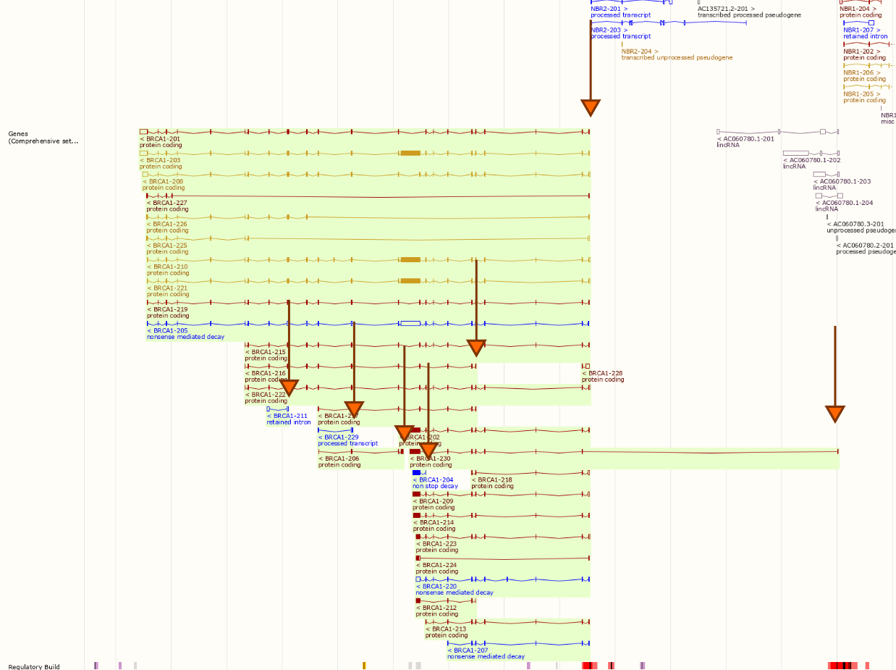
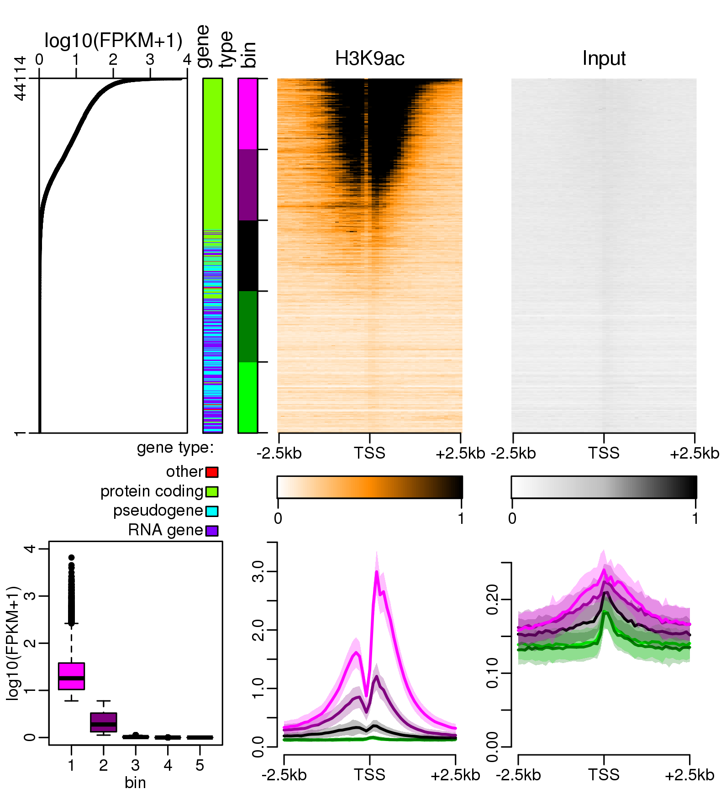
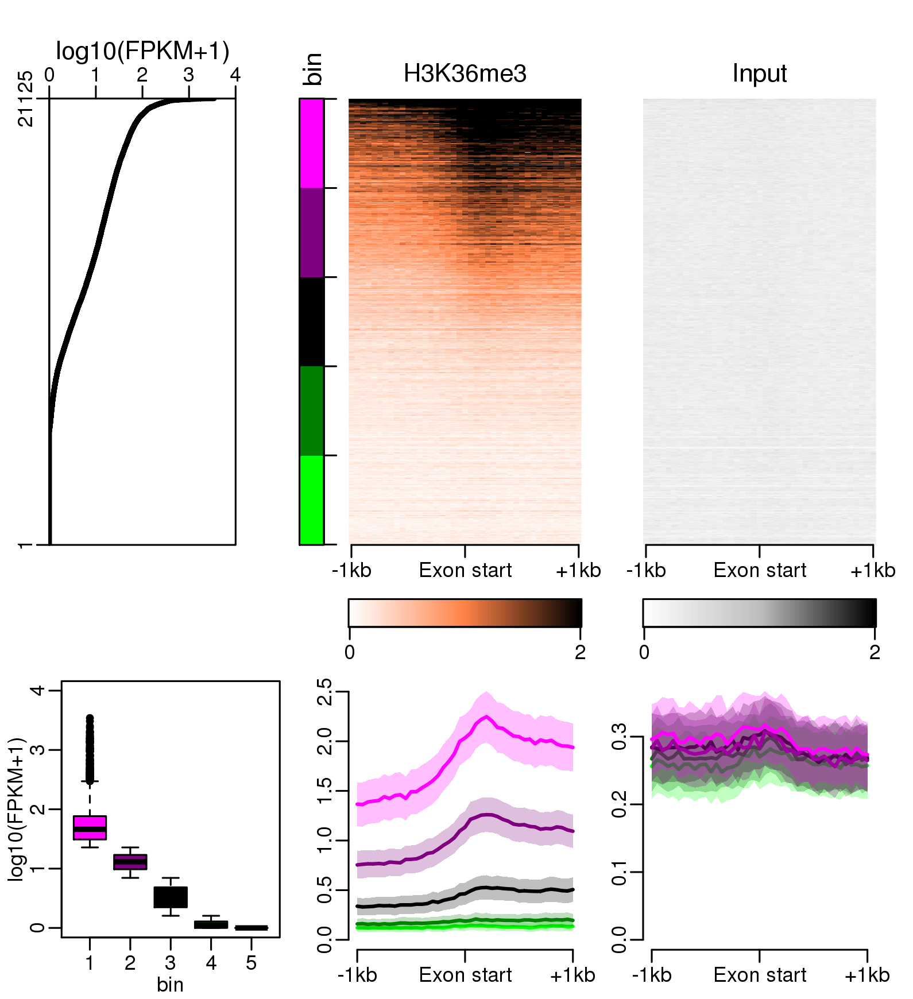
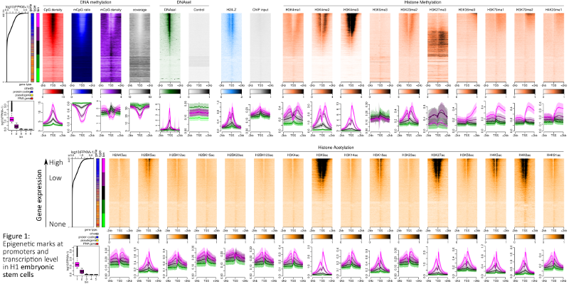

```{r setup, include=FALSE}
options(htmltools.dir.version = FALSE)

library(knitr)
opts_chunk$set(cache = FALSE, cache.lazy = FALSE, collapse = TRUE, fig.align = "center", echo = FALSE, warning = FALSE, message = FALSE)

library(tidyverse)
library(cowplot)
library(plotly)
library(kableExtra)
```

class: inverse, middle, font180

# Epigenetic marks and the human transcript diversity


### GenEpi@Genphyse
#### Guillaume Devailly - 2018/12/13
#### [@G_Devailly](https://twitter.com/G_Devailly)

---
class: font180

# Introduction

- Abundant epigenomic data for model organisms.
- Under-utilised?
- Epigenomic data will soon be abundant for agricultural species too.

## Dataset: 
- RNA-seq
- DNAse1
- WGBS,  10 different histone methylations, 17 different histone acetylations
- 33 cell lines & tissues

---
class: font160

# Objectives

.pull-left[
- Systemic correlation of marks and **gene** transcription level:
  - at TSS
  - at TTS
- Systemic correlation of marks and **exon**:
  - transcription level
  - inclusion ratio
- For **all** genes/exons in **each** cell type.
- For **each** gene/exon in **all** cell types.

]
.pull-right[

]

---
class: font180

# Methodology

**Processed data** taken from RoadmapEpigenomics:
- CpG methylation ratios
- DNAse-seq and ChIP-seq coverage

**Reprocessing** of fastq for Gene TPM, exon TPM & exon inclusion ratio (aka %spliced, or $\psi$):
- pseudo-mapping and quantification with [Salmon](https://combine-lab.github.io/salmon/)
- exon $\psi$ for exon **e** of gene **g** using *tpm* quantification of transcripts **t**:
$$\psi_{eg} = \frac{\sum_{t\subset e} tpm_t}{\sum_{t\in g} tpm_t}$$

---
class: font180

# What is a gene?
.pull-left[

]
.pull-right[

]

---
class: font180

# Where is BRCA1's Transcription Start Site (TSS)?


---
class: font180

# DNA methylation: ratio *and* density


---
class: font180

# DNA methylation: ratio *and* density


---
class: font180

# DNA methylation: ratio *and* density


---
class: font180, center

# Promoter DNA methylaton

Lung, all genes


---
class: font180, center

# Promoter DNA methylaton

Lung, protein coding genes


---
class: font180, center

# Promoter DNA methylaton

.pull-left[
Lung, lincRNA genes


]

.pull-right[
Lung, processed pseudogenes


]

---
class: font140, center

# Activating marks

.pull-left[
DNAse-seq, all genes, H1-derived mesoderm


]

.pull-right[
H3K9ac ChIP-seq, all genes, H1-derived mesoderm


]

---
class: font140, center

# Repressing marks

.pull-left[
H3K27me3, all genes, Thymus


]

--

.pull-right[
H3K27me3, protein coding genes, Thymus


]

---
class: font180, center

# Assymetric marks

H3K79me2, protein coding genes, H1-derived mesoderm


---
class: font180, center

# Exonic marks

H3K36me3, fetal large intestine


---
# A role in alternative splicing?

H3K36me3, HUES64 cell line

.pull-left[

]

.pull-right[

]

---
class: font180

# Cell by cell *vs* gene by gene

.pull-left[
WGBS, adult liver

]

--

.pull-right[
```{r}
lyl1 <- readRDS("data/lyl1_wgbs.rds")

p <- ggplot(lyl1, aes(x = mCpG_ratio, y = log10(exp + 1))) +
    geom_smooth(method = "lm", se = FALSE, linetype = "dotted") +
    geom_point(aes(
        text =  cell_type,
        color = cell_type
    )) +
    theme_bw() +
    theme(legend.position = "none") +
    labs(x = "mean mCpG/CpG ratio at TSS +/-500bp", y = "log10(FPKM+1)", title = "LYL1 (ENSG00000104903)") +
    annotate("text", x = 0.5, y = c(1.85, 1.65), label = c("slope: -2.71", "R²: 0.56"))

ggplotly(p, tooltip = "text")

```
]

---
class: font180

# Repressing and activating marks

.pull-left[
### mCpG ratio

]

--

.pull-right[
### H3K4me3

]

---

# Summary of results

.pull-left[
```{r}
bilan <- read_tsv("data/summary.tsv") %>%
    rename(`center on TSS` = X4)
ac <- grepl("ac$", bilan$mark)
bilan <- bilan %>%
    mutate(
        `gene by gene` = cell_spec(`gene by gene`, "html", color = if_else(`gene by gene` == "positive", "darkgreen", "firebrick", missing = "grey")),
        `cell type by cell type` = cell_spec(`cell type by cell type`, "html", color = if_else(`cell type by cell type` == "positive", "darkgreen", "firebrick", missing = "slateblue")),
        `center on TSS` = if_else(is.na(`center on TSS`), "", "no"),
        mark = cell_spec(mark, "html", background = case_when(
            mark %in% c("WGBS", "DNAse", "H2A.Z" ) ~ "ivory",
            grepl("ac$", mark) ~ "lightblue",
            grepl("me", mark) ~ "paleturquoise",
            TRUE ~ "grey"
        ))
    ) %>%
    select(mark, `cell type by cell type`, `gene by gene`, `center on TSS`)

left_part <- bilan[!ac, ]
righ_part <- bilan[ac, ]

left_part %>%
    kable("html", escape = FALSE) %>%
    kable_styling("striped", full_width = FALSE, font_size = 14)
```
]

.pull-right[
```{r}
righ_part %>%
    kable("html", escape = FALSE) %>%
    kable_styling("striped", full_width = FALSE, font_size = 14)
```

]

---
class: font180

# Lots of results

Combinatorial explosion: > 9000 plots!

.center[

]

---
class: font160

# PEREpigenomics

*P*rofile *E*xplorer of *R*oadmap *Epigenomic* data  
[www.perepigenomics.roslin.ed.ac.uk](http://www.perepigenomics.roslin.ed.ac.uk/)

.center[

]

---
class: font180

# Perspective

- More features (mono-, bi-, tri- exonic genes, gene families, etc.)
- More marks
- Causality analysis using perturbation experiments
- FAANG data

---
class: font180

# R user group Toulouse

.center[

]

* website: [r-toulouse.netlify.com](https://r-toulouse.netlify.com/)
* twitter: [https://twitter.com/RUG_Toulouse](@RUG_Toulouse)
* mailing list: [groups.google.com/forum/#!forum/r-toulouse](https://groups.google.com/forum/#!forum/r-toulouse)

---
class: font180

# Thanks

.pull-left[
Anagha Joshi

Anna Mantsoki

Deepti Vipin
]

.pull-right[


]
