```{r setup, include=FALSE}
options(htmltools.dir.version = FALSE)

library(knitr)
opts_chunk$set(cache = FALSE, cache.lazy = FALSE, collapse = TRUE, fig.align = "center", echo = FALSE, warning = FALSE, message = FALSE)
```

class: inverse, middle, font180

# Impact du climat, du stress thermique, et de la génétique sur le niveau d'expression des gènes des porcs du programme *PigHeaT*

.pull-left[

### GenEpi@Genphyse
#### Guillaume Devailly - 2018/10/02-04
#### [@G_Devailly](https://twitter.com/G_Devailly)
]
.pull-right[
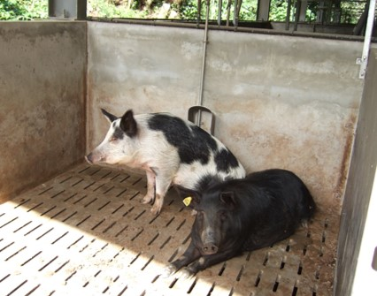

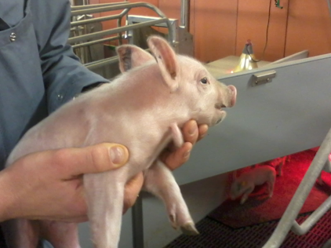
]
---
class: font140

# Le programme PigHeaT :
.pull-left[
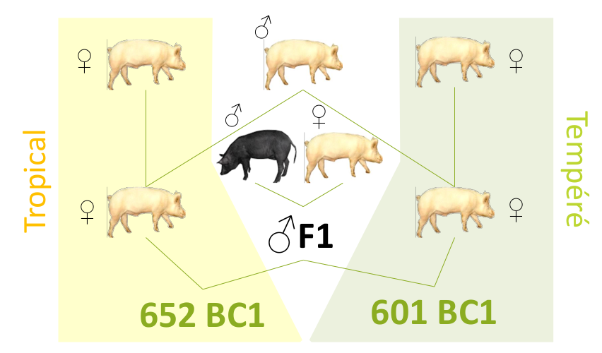
]
.pull-right[
+ Rétro-croisement de porcs **Large White** et **Créole**
{{content}}
]

--
+ Élevés en environnement tempéré ou tropical
+ Stress thermique (semaines 24 à 26) sur les animaux élevés en climat tempéré. Prises de sang avant, 48h après, et 15 jours après le début du stress.
{{content}}
--
+ Génotype, métabolome & transcriptome sanguin, microbiote 16S
{{content}}
--
+ Génétique quantitative : [Rosè et al., 2017](https://www.ncbi.nlm.nih.gov/pubmed/29293699), bio-marqueurs métaboliques : [Dou et al., 2017](https://www.ncbi.nlm.nih.gov/pubmed/29176781)
{{content}}

--

-> Détection de QTL, GxE : **poster de Yann Labrune** 

---
# Génotypage des animaux 

.pull-left[

]

.pull-right[
+ .font140[puce 60K]

.font140[← Matrice d'apparentement]
]

---
class: inverse, middle, font180

# Analyses transcriptomiques
 

### Puces Agilent SurePrint G3 Pig GE 8x60K (AMID 37880), Get-TRiX

---
class:
# .font80[Expression différentielle entre climat tempéré et tropical]

.pull-left[
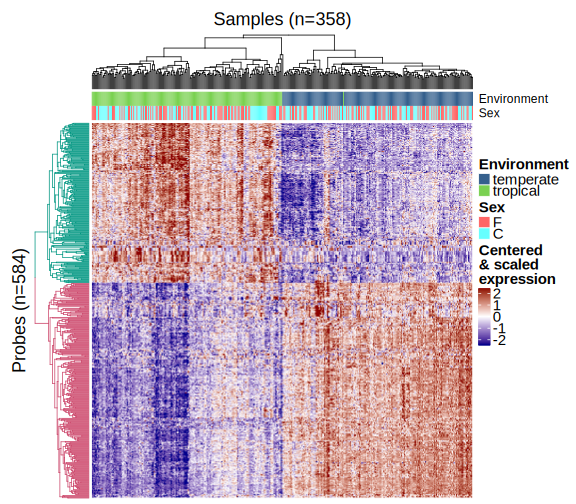
]

.pull-right[
Prise en compte des effets sexe, de la bande, et du lot d'analyse transcriptomique, avec *Limma*.
{{content}}
]

--

Analyses ontologiques peu concluantes.
```{r}
library(tidyverse)
kable(tribble(
    ~Ontologie, ~Up_in_trop, ~Down_in_trop,
    "Cellular response to TGFβ stimulus", "X", "",
    "Macrophage derived foam cell differentiation", "X", "",
    "Regulation of heterotypic cell-cell adhesion", "X", "",
    "Mitochondrial electron transport, cytochrome c to oxygen ", "", "X",
    "Death-inducing signaling complex assembly", "", "X"
), format = "html", col.names = c("Ontologie", "Tropical", "Tempéré"))
```
{{content}}

---
layout: true

# Détection de QTL d'expression

---

.pull-left[ 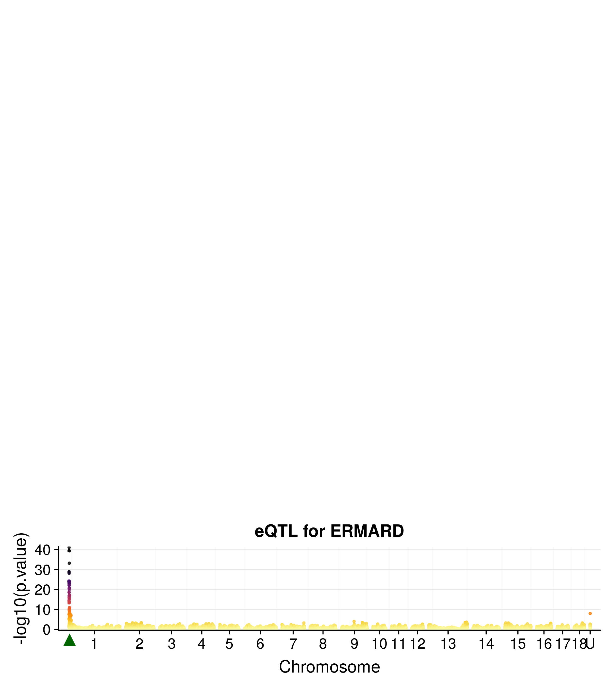 ]
.pull-right[ GWAS avec *GEMMA* ]

---

.pull-left[  ]
.pull-right[ GWAS avec *GEMMA* ]

---

.pull-left[ 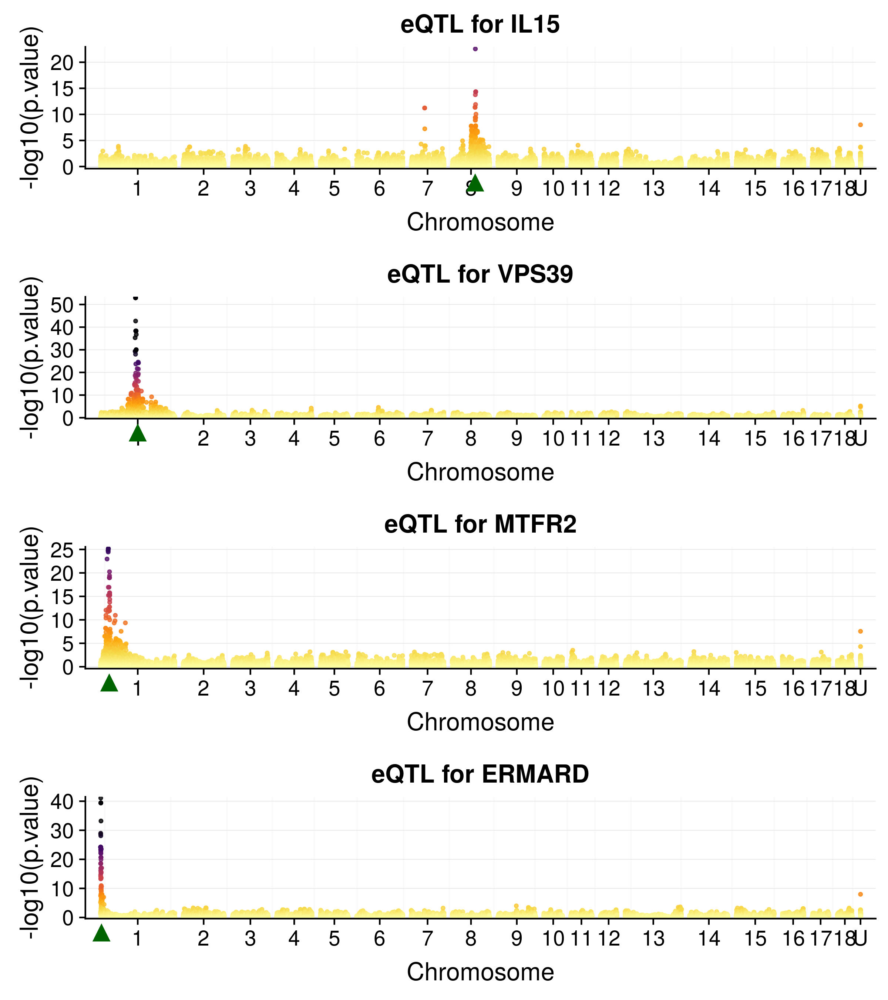 ]
.pull-right[ GWAS avec *GEMMA* ]

---

.pull-left[
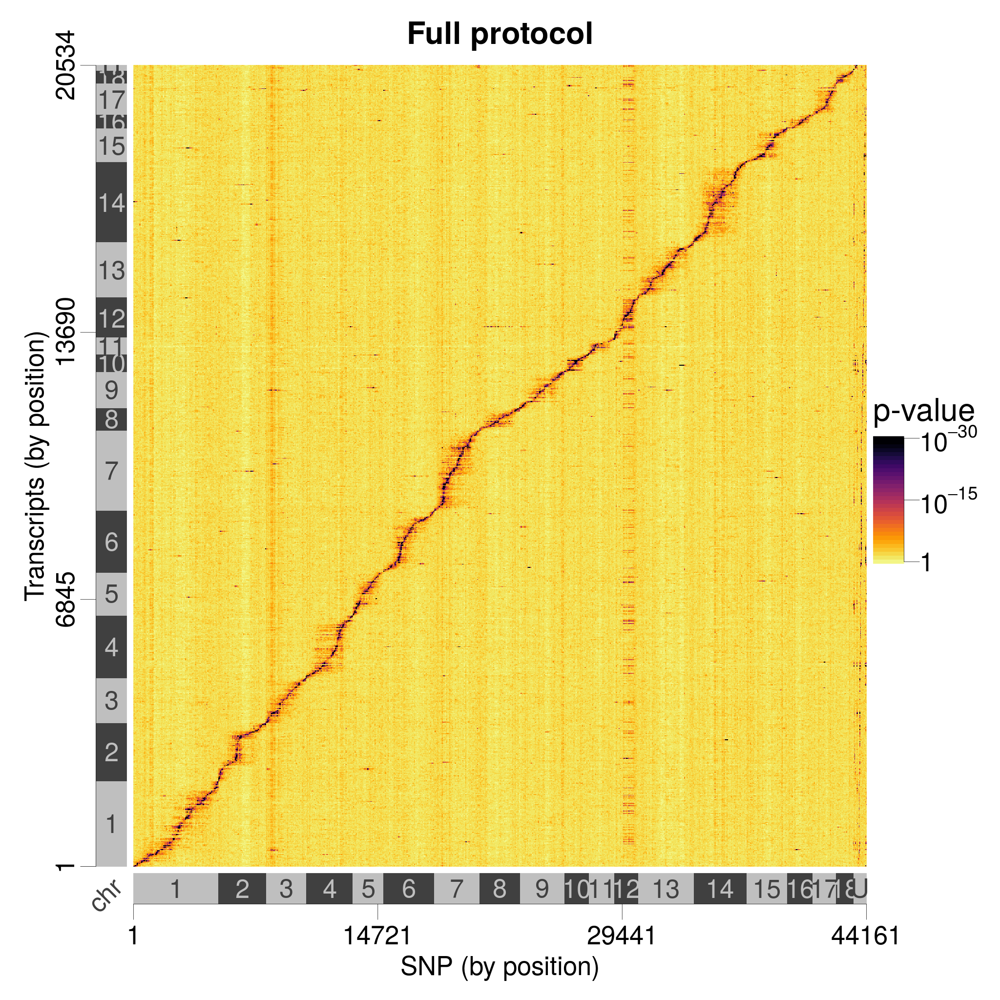
]

--

.pull-right[
+ .font140[Comparaison eQTL / QTL phénotypiques ?]
+ .font140[Catalogue d'eQTL en ligne ?]
]

---
layout: false

# .font80[Interactions GxE dans la régulation du niveau d'expression]

.pull-left[
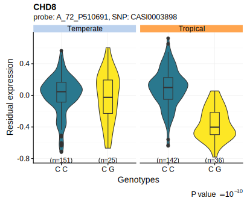
]

---
# .font80[Interactions GxE dans la régulation du niveau d'expression]

.center[

]

---
# .font80[Interactions GxE dans la régulation du niveau d'expression]

.center[
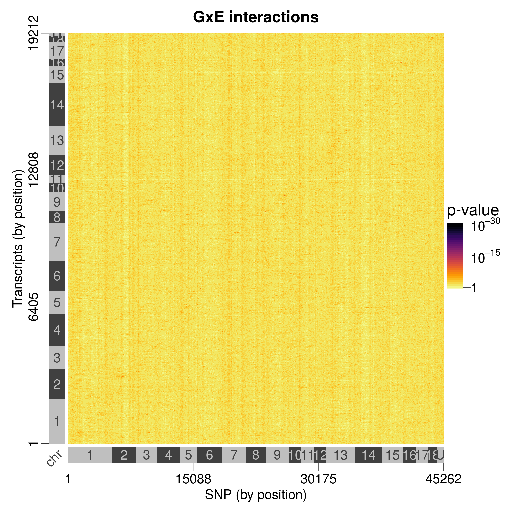

.font150[Manque de puissance ?]
]

---
class: inverse, center, middle

# Stress thermique en climat tempéré
## .center[Trois semaines à 30°C]

---
# Analyse d'expression différentielle
.pull-left[
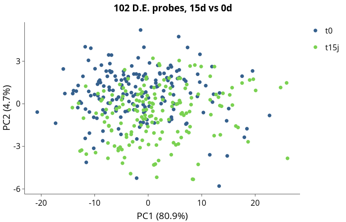
]
.pull-right[
.font140[Variabilité individuelle plus importante que l'effet stress.]
]

---
# Identification de biomarqueurs ?


.pull-left[
.font140[
Corrélation entre :
.center[
expression **avant le stress** 

et 

gain de température corporelle la première semaine du stress
]
]
]

.pull-right[
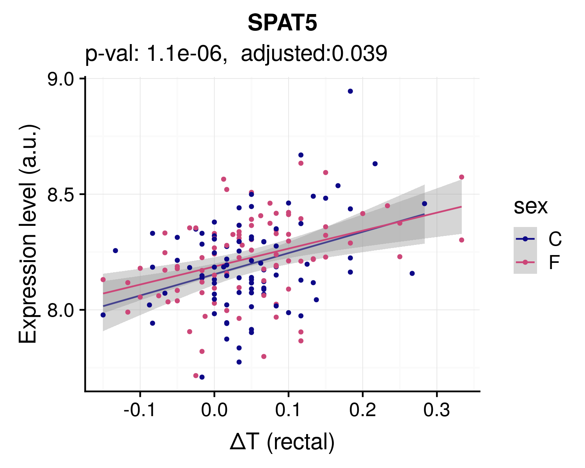
]

---
# Identification de biomarqueurs ?

.center[
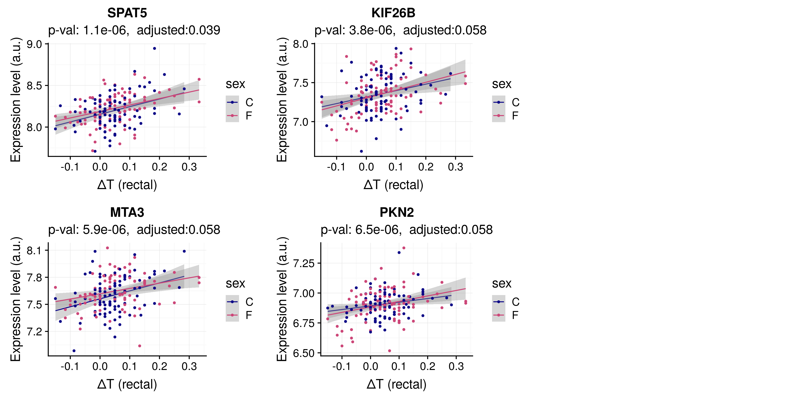

]

---
# Identification de biomarqueurs ?

.center[
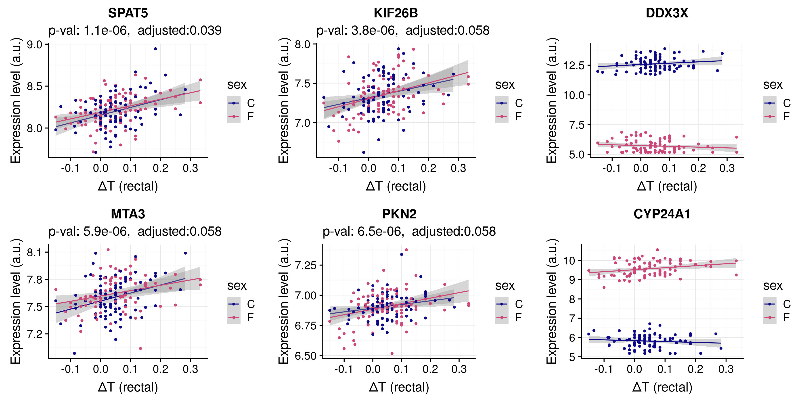

]

---
# Combiner les marqueurs ?

.pull-left[
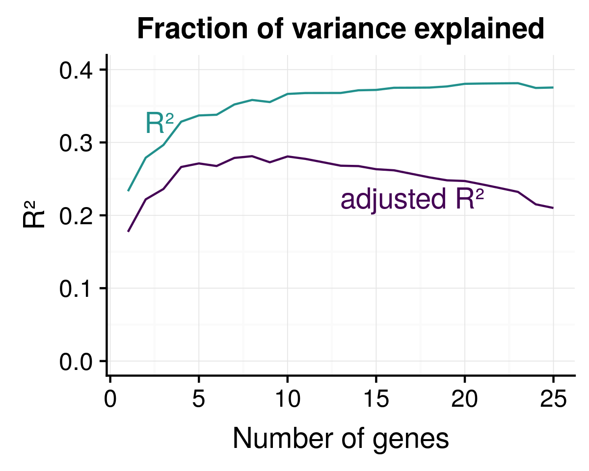
]

.pull-right[
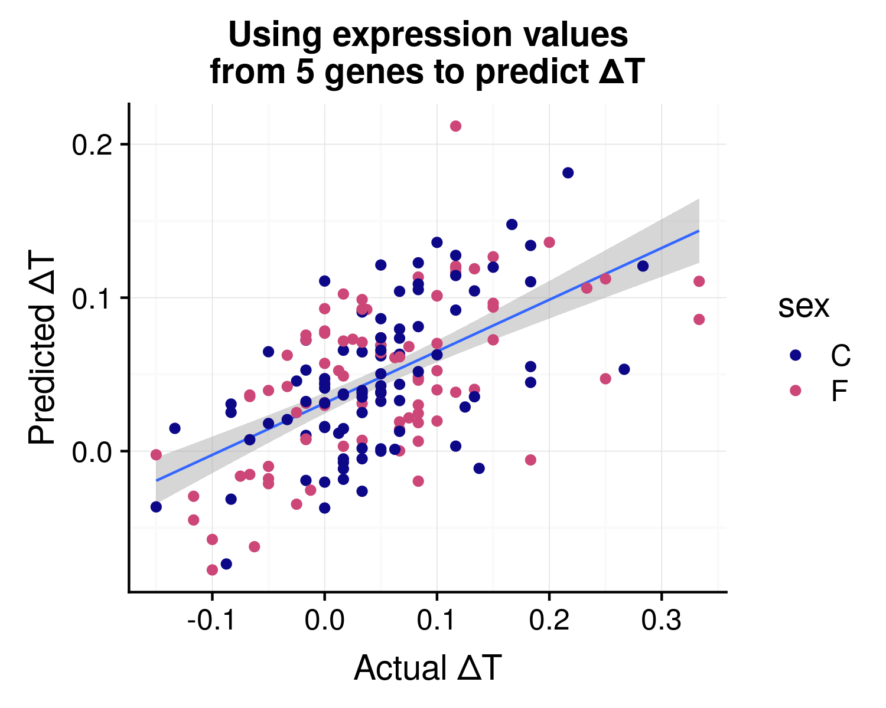
]

---
# Conclusions
.font140[
+ Les différences entre les deux élevages ont un effet sur le transcriptome sanguin.
+ Nombreux eQTL détectés, majoritairement près du gène régulé.
+ Des interactions GxE dans la régulation de l’expression des gènes.
+ Identifications de gènes marqueurs ?
]

## Perspectives
.font140[
+ Utiliser les données transcriptomiques pour "annoter" les QTL phénotypiques identifiés (*cf* poster de Yann Labrune).
+ Analyses sur la réponse transcriptomique au stress : 
    - corrélation changements phénotypiques et changements transcriptomiques
    - eQTL de réponse au stress
]
---
# Remerciements
.center[
 
]

.pull-left[
+ Yann Labrune
+ Katia Feve
+ Laure Gress
+ Jean-Luc Gourdine
+ Hélène Gilbert
+ David Renaudeau
+ Juliette Riquet
+ Nathalie Vialaneix
+ Yvon Billon, Mario Giorgi et l'ensemble du personnel des UE du Magneraud et de PTEA
+ et toute l'équipe GenEpi !
]
