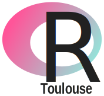
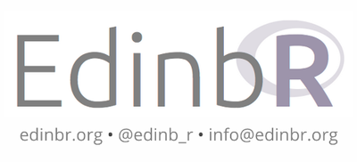
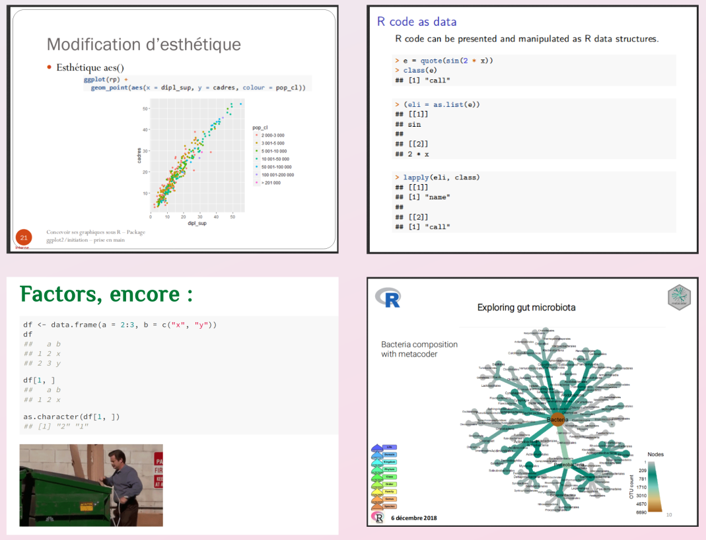
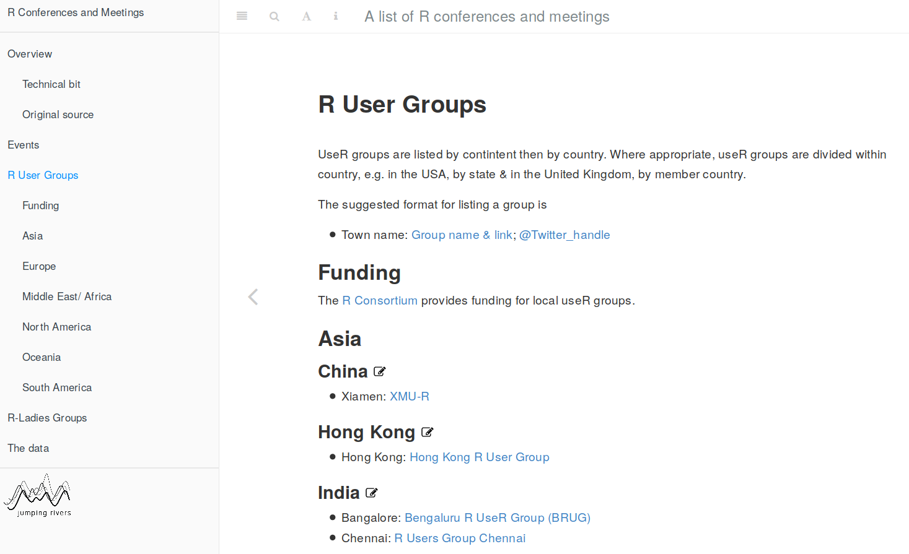
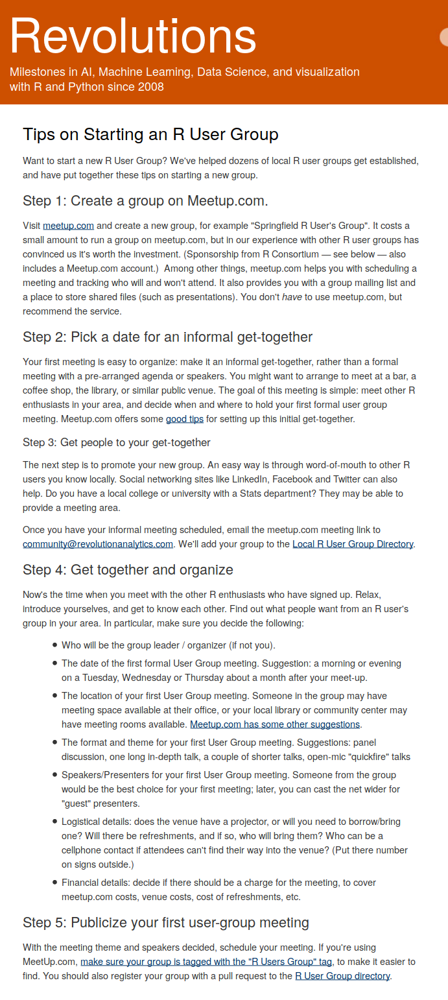

class: inverse, bottom, font180

```{r setup, include=FALSE}
options(htmltools.dir.version = FALSE)

library(knitr)
opts_chunk$set(cache = FALSE, cache.lazy = FALSE, collapse = TRUE, fig.align = "center", echo = FALSE, warning = FALSE, message = FALSE)
```

background-image: url("img/Rbeasts.jpeg")
background-position: 10% 0%
background-size: 36%

.pull-right[
  
`r icon::fa("twitter")` [@G_Devailly](https://twitter.com/G_Devailly)  
Guillaume Devailly  
useR!2019  
2019/07/08

]

---
layout: true
class: font180

---

# R user groups
*aka RUG*

- local R events, organised by local user for local user (might be in the local language)

- usually free & open to all (might require registration): students, professional, hobbyist, all levels of expe**R**tise, from beginne**R**s to expe**R**ts.

- presentations, long and short, tutorials, workshops, hackathons, meetings


---

# My experience with RUGs


- 2 years as attendee at [edinbR](http://edinbr.org/)


- 1 year as organiser at [R-toulouse](https://r-toulouse.netlify.com/)

---
# Topics covered in the last year at R-Toulouse
.pull-left[
- Introduction to ggplot2
- Symbolic differentiation with Deriv
- The plotluck package
- C'est l'enfeR: traps of the R language
- Introduction to the tidyverse
- The Metacoder package
- base, data.table and dplyr benchmark
- Bayesian statistics with Rjags
- Introduction to shiny
- GADMtools package
]
.pull-right[

]
---

# Is there an R user group in my city?

[jumpingrivers.github.io/meetingsR/r-user-groups.html](https://jumpingrivers.github.io/meetingsR/r-user-groups.html)



---

# Is there an R user group in my city?

- see also R Ladies [here](https://jumpingrivers.github.io/meetingsR/r-user-groups.html) or [here](https://rladies.org/)
- R studio community [event page](https://community.rstudio.com/c/irl)
- search on [twitter](https://twitter.com/search?q=R%20user%20group&src=typed_query&f=user)
- search on [meetup.com](https://www.meetup.com/find/?allMeetups=false&keywords=R+user+group&radius=Infinity)
- ask around

---

# How to start an R user group?

- organiser**s**
- a room (universities usually happy to host such events for free)
- a website
- a mailing list
- social media account(s)
- one or two speakers
- a code of conduct

---

# How to start an R user group?

[blog.revolutionanalytics.com/tips-on-starting-an-r-user-group.html](https://blog.revolutionanalytics.com/tips-on-starting-an-r-user-group.html)



---

# R User Group Support Program

[www.r-consortium.org/projects/r-user-group-support-program](https://www.r-consortium.org/projects/r-user-group-support-program)

A meetup.com Pro account + 
- **Vector level:** $150, at least 5 people
- **Matrix level:** $320, at least 50 people attending at least 3 meetings in the last 6 months
- **Array level:** $820, at least 100 people attending at least 3 meetings in the last 6 months

+ adhesion to the R consortium [code of conduct](https://wiki.r-consortium.org/view/R_Consortium_and_the_R_Community_Code_of_Conduct)

---
class: inverse, center

background-image: url("img/Rbeasts.jpeg")
background-position: 50% 0%
background-size: 36%
