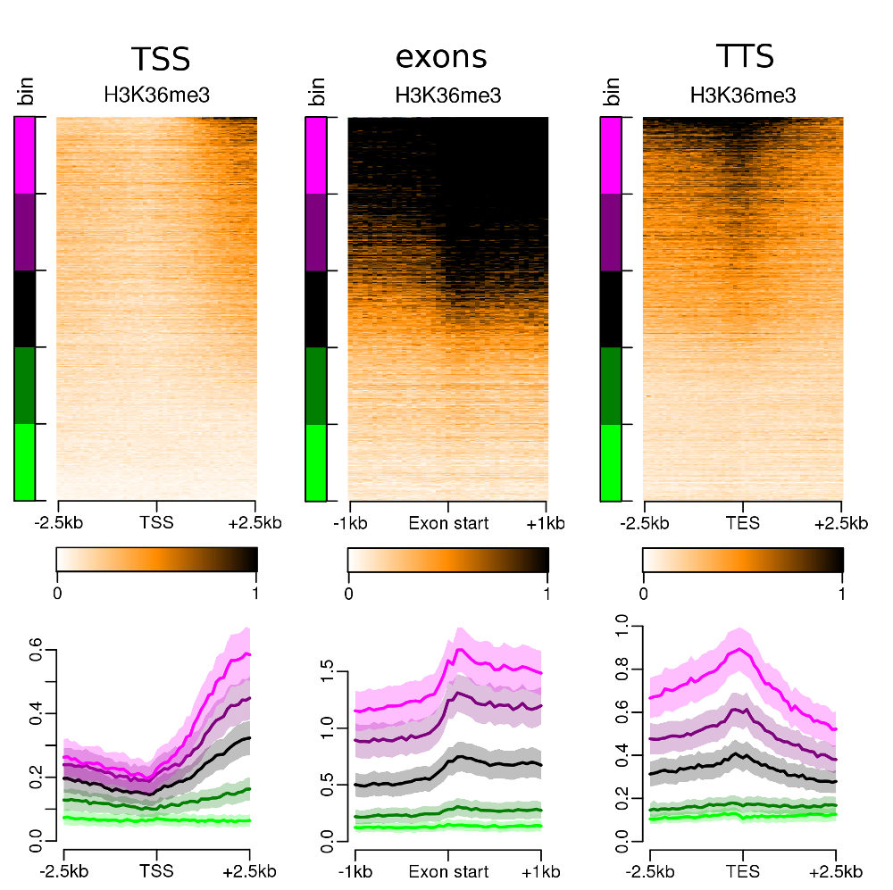
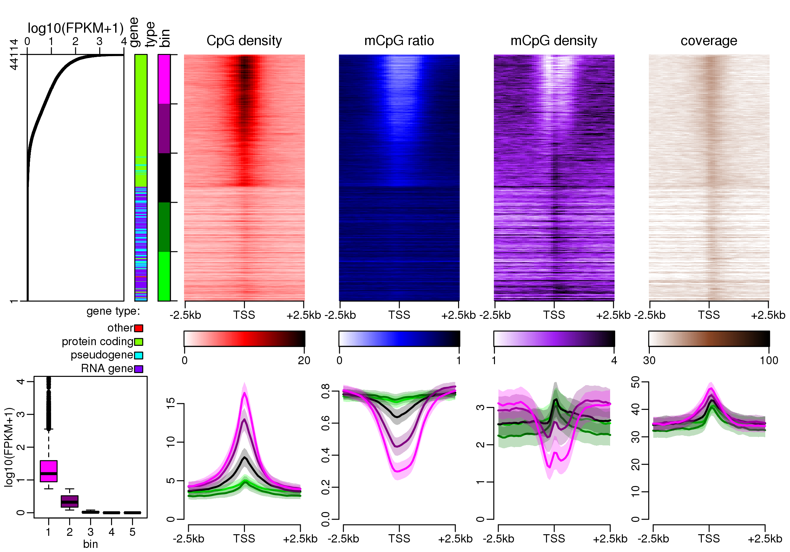

class: inverse, bottom, font180

```{r setup, include=FALSE}
options(htmltools.dir.version = FALSE)

library(knitr)
opts_chunk$set(cache = FALSE, cache.lazy = FALSE, collapse = TRUE, fig.align = "center", echo = FALSE, warning = FALSE, message = FALSE)

library(tidyverse)
library(cowplot)
library(plotly)
library(kableExtra)
```

# PEREpigenomics
## Profile Explorer of Roadmap Epigenomics data
<html>
  <div style='float:left'></div>
  <hr color='#EB811B' size=1px width=100%>
</html>
.pull-left[

`r icon::fa("twitter")` [@G_Devailly](https://twitter.com/G_Devailly)  
Guillaume Devailly  
useR!2019  
2019/07/09
]
.pull-right[


]

---
layout: true
class: font180
background-image: url("img/genphyse_inra_logo.png")
background-position: 0% 100%
background-size: 15%

---

# One genome, many cell types

.pull-left[

]
.pull-right[
.center[
Differential gene expression =  
cellular environment + epigenetics
]
]

---

# Epigenetics data

.pull-left[
Many existing datasets and databases.
## Dataset: 
- RNA-seq
- DNAse1
- WGBS,
- 10 different histone methylations
- 17 different histone acetylations

in 33 human cell lines & tissues, uniformly processed.
]

.pull-right[

]

---

# What to do with big dataset?

.pull-left[
Build a data portal:
]

.pull-right[

]

---

# What to do with big dataset?

Link data to genome browser:
.center[]

---

# What to do with big dataset?

Machine learning:


.right[.font60[Kundaje, Meuleman, Ernst, Bilenky et al., 2015, [10.1038/nature14248](https://doi.org/10.1038/nature14248)]]

---

# Objectives

.pull-left[
- Visualisation of marks, sorted by **gene** transcription level:
  - at TSS (gene start)
  - at TTS (gene end)
- Visualisation of marks at **middle exons** starts, sorted by:
  - transcription level
  - inclusion ratio
- For **all** genes/exons in **each** cell type.
- For **each** gene/exon in **all** cell types.
]

.pull-right[

]

---
class: inverse

# H3K4me3, TSS, small intestine

.center[

]

---

# Different gene types, different associations
.pull-left[
lincRNA  

]
.pull-right[
processed pseudogenes  

]

---
# Position of signal matters
.pull-left[
DNAse 1 (accessible chromatin)  

]
.pull-right[
H3K27ac  

]

---
class: inverse, center

# Exonic mark: H3K36me3, fetal large intestine



---
class: font180

# DNA methylation: ratio *and* density


---
class: center
# Exonic DNA methylation

WGBS, pancreas  


---

# Cell by cell *vs* gene by gene

.pull-left[
WGBS, adult liver

]

--

.pull-right[
```{r}
lyl1 <- readRDS("data/lyl1_wgbs.rds")

p <- ggplot(lyl1, aes(x = mCpG_ratio, y = log10(exp + 1))) +
    geom_smooth(method = "lm", se = FALSE, linetype = "dotted") +
    geom_point(aes(
        text =  cell_type,
        color = cell_type
    )) +
    theme_bw() +
    theme(legend.position = "none") +
    labs(x = "mean mCpG/CpG ratio at TSS +/-500bp", y = "log10(FPKM+1)", title = "LYL1 (ENSG00000104903)") +
    annotate("text", x = 0.5, y = c(1.85, 1.65), label = c("slope: -2.71", "R²: 0.56"))

ggplotly(p, tooltip = "text")

```
]

---
# Repressing and activating marks

.pull-left[
### mCpG ratio

]

--

.pull-right[
### H3K4me3

]

---
class: inverse, center

# Too many plots?

.center[

]

---
# PEREpigenomics

*P*rofile *E*xplorer of *R*oadmap *Epigenomic* data  
[www.perepigenomics.roslin.ed.ac.uk](http://www.perepigenomics.roslin.ed.ac.uk/)

.center[

]

---
# Summary of results

.pull-left[
```{r}
bilan <- read_tsv("data/summary.tsv") %>%
    rename(`center on TSS` = X4)
ac <- grepl("ac$", bilan$mark)
bilan <- bilan %>%
    mutate(
        `gene by gene` = cell_spec(`gene by gene`, "html", color = if_else(`gene by gene` == "positive", "darkgreen", "firebrick", missing = "grey")),
        `cell type by cell type` = cell_spec(`cell type by cell type`, "html", color = if_else(`cell type by cell type` == "positive", "darkgreen", "firebrick", missing = "slateblue")),
        `center on TSS` = if_else(is.na(`center on TSS`), "", "no"),
        mark = cell_spec(mark, "html", background = case_when(
            mark %in% c("WGBS", "DNAse", "H2A.Z" ) ~ "ivory",
            grepl("ac$", mark) ~ "lightblue",
            grepl("me", mark) ~ "paleturquoise",
            TRUE ~ "grey"
        ))
    ) %>%
    select(mark, `cell type by cell type`, `gene by gene`, `center on TSS`)

left_part <- bilan[!ac, ]
righ_part <- bilan[ac, ]

left_part %>%
    kable("html", escape = FALSE) %>%
    kable_styling("striped", full_width = FALSE, font_size = 14)
```
]

.pull-right[
```{r}
righ_part %>%
    kable("html", escape = FALSE) %>%
    kable_styling("striped", full_width = FALSE, font_size = 14)
```

]

---
class: font180

## Conclusions

PEREpigenomics offers interesting visualisations of epigenetic data gathered by
Roadmap Epigenomics.

## Perspectives

- update with new annotation data (ongoing)
- preprint & source code available soon
- develop similar approach for [FAANG](http://data.faang.org/home) (Functional Annotation of the Animal Genomes) data

---
layout: false
class: font180
# Thanks

.pull-left[
Anagha Joshi

Anna Mantsoki

Deepti Vipin
]

.pull-right[

]
