```{r setup, include=FALSE}
options(htmltools.dir.version = FALSE)

library(knitr)

opts_chunk$set(cache = TRUE, cache.lazy = FALSE, collapse = TRUE, fig.align = "center")
```
class: inverse, center, middle

#Web applications for human epigenomics

.pull-left[
### EPIGEN2018
2018-03-14
]

.pull-right[
### Guillaume Devailly
[@G_Devailly](https://twitter.com/G_Devailly)


]

.right[
**
]
---
class: largetext

# Why web applications?

- easy to access
- easy to use *(?)*
- fancy and attracting

**→ Allow users to do things they won't have done otherwise**

--
### *but...*

- someone has to develop and maintain them...
- (almost) no flexibility
- apps appear and disappear with a high turnover

---
class: inverse, largetext

# Types of web-apps for epigenomics

.pull-left[
1. Data portals

2. Genome browsers

3. Compare experiments

4. Analyse
]

---
class: inverse, largetext
count: false

# Types of web-apps for epigenomics

.pull-left[
1. Data portals

2. 

3. 

4. 
]

.pull-right[
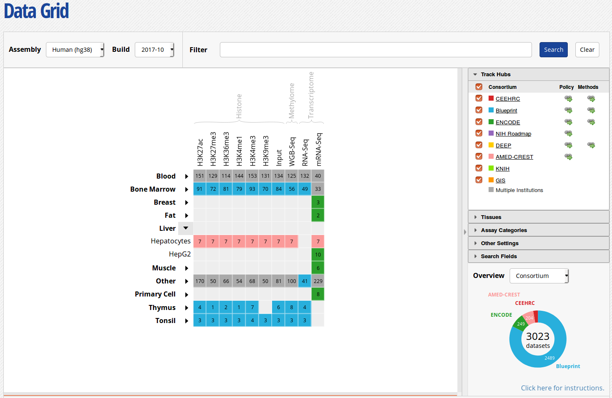
]

---
layout: true

# Data portals

---
class: large

- An eagle-eye view of available data.
- Easier to use than SRA / GEO searches
---

### A precursor: [ENCODE @ UCSC](https://genome.ucsc.edu/encode/dataMatrix/encodeDataMatrixHuman.html)

.center[
<video width="650" height="auto" controls loop style="border: 1px solid gray;">
  <source src="vid/encode_old.webm" type="video/webm">
Your browser does not support the video tag.
</video> 
]

### *unmaintained since 2012*

---
### Modern [ENCODE data portal](https://www.encodeproject.org/)
.center[
<video width="650" height="auto" controls loop style="border: 1px solid gray;">
  <source src="vid/new_encode.webm" type="video/webm">
Your browser does not support the video tag.
</video> 
]

---
layout: false
## Other consortia
.pull-left[


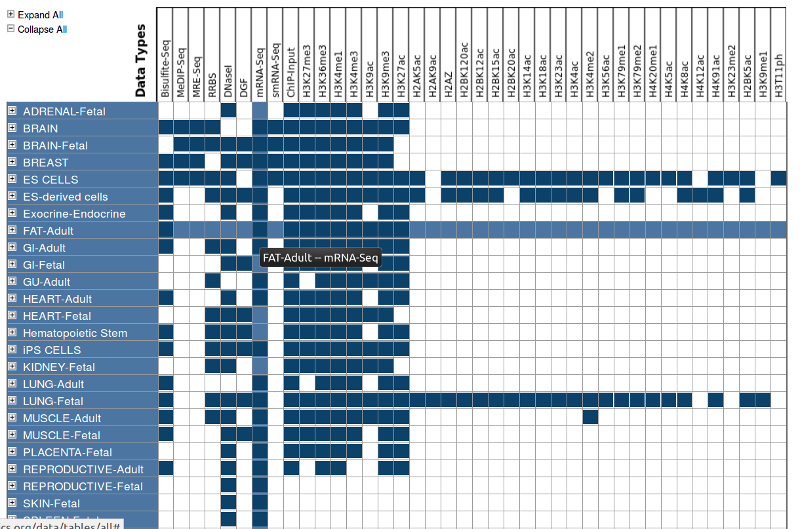
]
.pull-right[


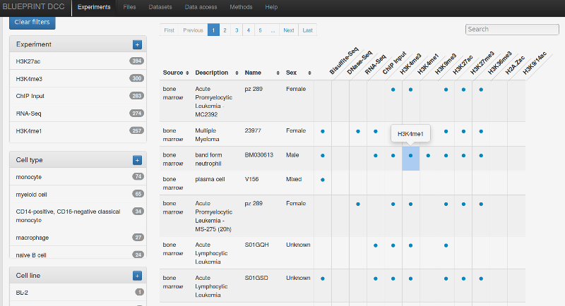
]

---
## International Human Epigenome Consortium [(IHEC)](http://epigenomesportal.ca/ihec/index.html)
.pull-left[
<video width="650" height="auto" controls autoplay loop style="border: 1px solid gray;">
  <source src="vid/ihec_hg19_hg38.webm" type="video/webm">
Your browser does not support the video tag.
</video> 
]
.pull-right[

]

---
# Data portals

Portals browsing SRA/ENA public datasets:
- **[codex.stemcells.cam.ac.uk](http://codex.stemcells.cam.ac.uk/)**: TF & HisMod ChIP-seq, RNA-seq, DNase-seq in Haematopoietic Cells, or Embryonic Stem Cells

- **[cistrome.org](http://cistrome.org)**: TF & HisMod & DNase/ATAC, all cell types & tissues

- **[ngs-qc.org](http://www.ngs-qc.org)**: Almost everything (TF, HisMod, RNA, MeDP, ...), all cell types & tissues, assess dataset quality

### → Finding data is easy

---
class: inverse, largetext
count: false

# Types of web-apps for epigenomics

.pull-left[
1. 

2. Genome browsers

3. 

4. 
]
.pull-right[
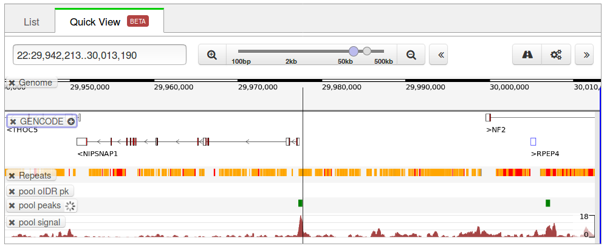
]

---
class: largetext

# Online Genome browsers
- quick look at the data

- looking at a few regions manually

- Sometimes ♥ *integrated to the Data portal* ♥

---
## ENCODE quick view genome browser
.center[
<video width="800" height="auto" controls loop style="border: 1px solid gray;">
  <source src="vid/encode_gb.webm" type="video/webm">
Your browser does not support the video tag.
</video> 
]

---
## Roadmap *Chromatin states* browser
.center[
[egg2.wustl.edu/roadmap/web_portal/chr_state_learning.html](http://egg2.wustl.edu/roadmap/web_portal/chr_state_learning.html)

<video width="800" height="auto" controls loop style="border: 1px solid gray;">
  <source src="vid/roadmap_chromatin_states.webm" type="video/webm">
Your browser does not support the video tag.
</video> 

*Uses the great [WahsU EpiGenome Browser](http://epigenomegateway.wustl.edu/browser/)*

]

---
# Other great options

- **Ensembl** regulatory build

- **Cistrome** send any tracks to the WashU EpiBrowser in a single click

- **NGS-QC** is developing [NAVi](http://www.ngs-qc.org/navi/index.php)
.center[
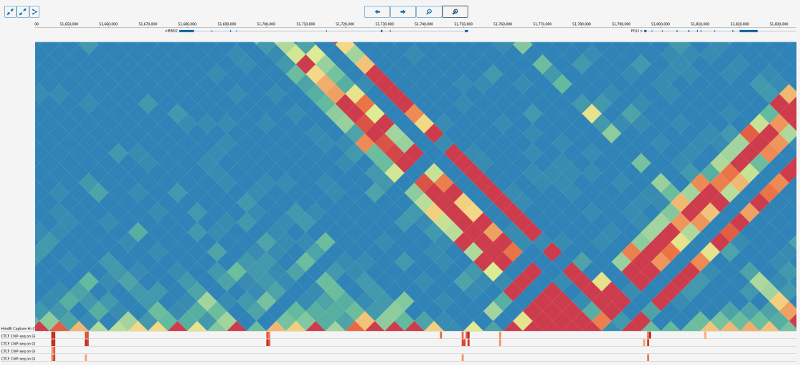
]

---
## Most of the time...

.center[
Old & unfriendly
**or**
New & buggy ?

<video width="800" height="auto" controls loop style="border: 1px solid gray;">
  <source src="vid/blueprint.webm" type="video/webm">
Your browser does not support the video tag.
</video> 
]

---

class: inverse, largetext
count: false

# Types of web-apps for epigenomics

.pull-left[
1. 

2. 

3. Compare experiments

4. 
]
.pull-right[
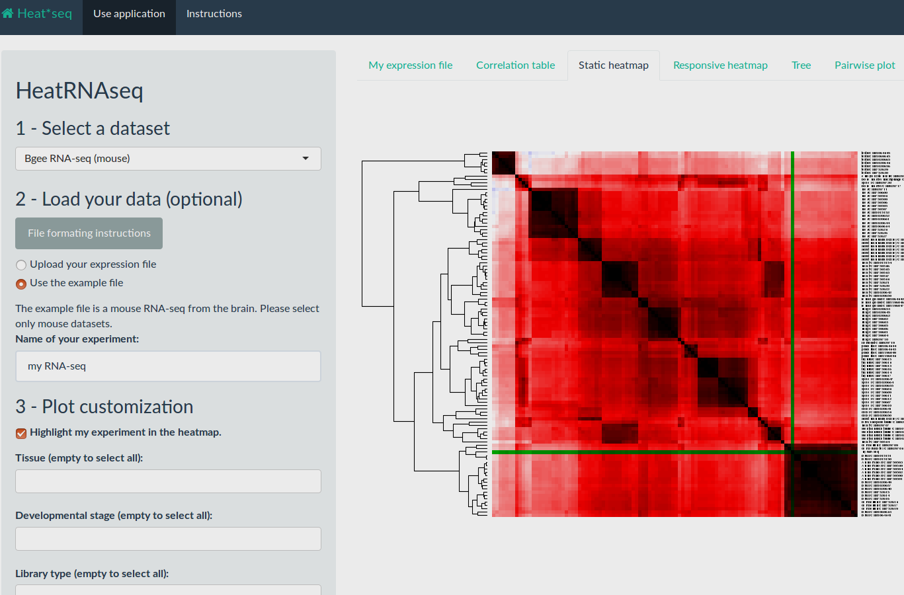
]

---
# Heat*seq: genome-wide comparison of NGS experiments
- RNA-seq, TF-ChIP-seq, CAGE

- Compare a processed file you upload to all experiments in a dataset

- available at [www.heatstarseq.roslin.ed.ac.uk](http://www.heatstarseq.roslin.ed.ac.uk/)

.center[
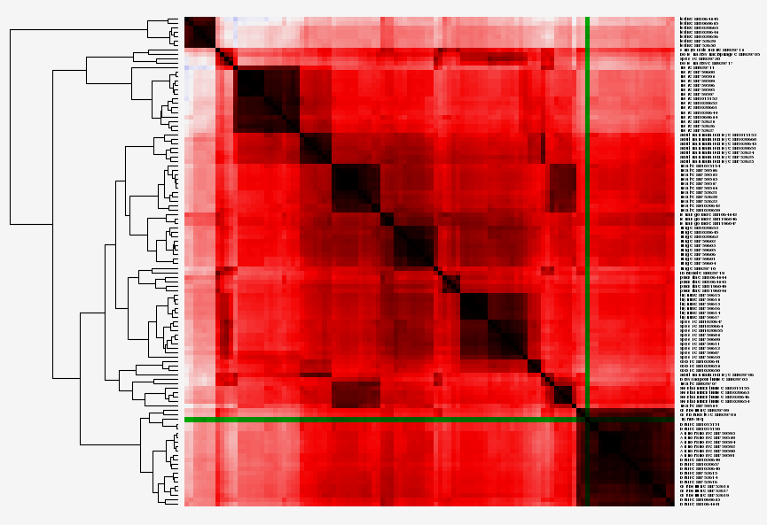
]

---
class: largetext

# Clustered correlation heatmaps:

- Correlation of every pairs of experiment

- Clustering of the correlation matrix

- Two similar experiment will be close on the clustered correlation heatmap

.center[
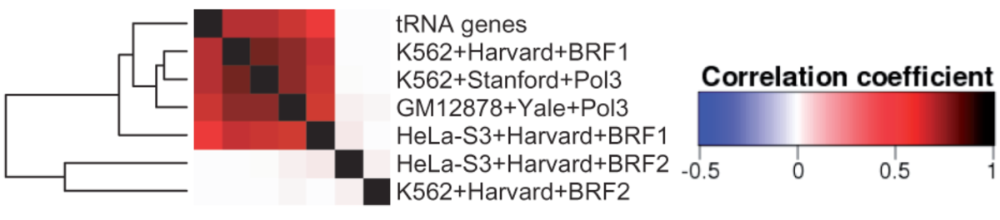
]

---
# Heat*seq: genome-wide comparison of NGS experiments

Example: ESR1 TF ChIP-seq from GEO, compared against all TF ChIP-seq from ENCODE

.center[
<video width="800" height="auto" controls loop style="border: 1px solid gray;">
  <source src="vid/HeatChIPseq.webm" type="video/webm">
Your browser does not support the video tag.
</video> 
]

Input file: peak list, *.bed* format.

---
# Alternatives:

**CODEX** Correlation analysis 
.center[
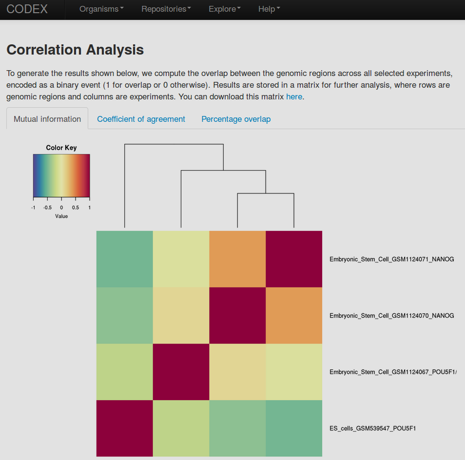
]

---
class: inverse, largetext
count: false

# Types of web-apps for epigenomics

.pull-left[
1. 

2. 

3. 

4. Analyse
]
.pull-right[
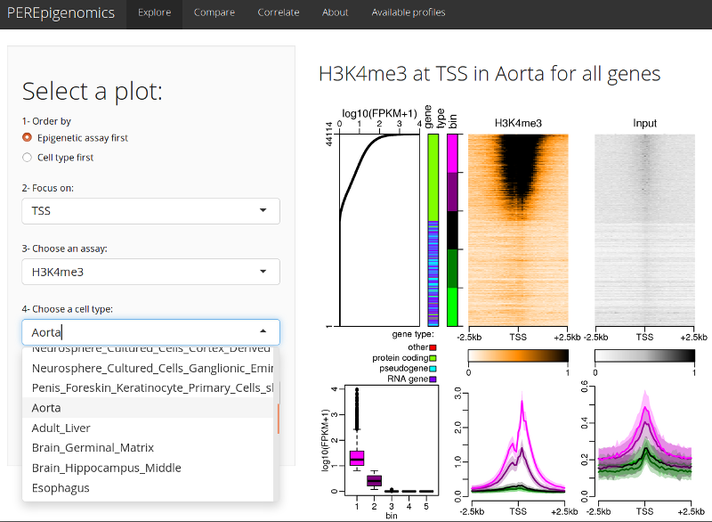
]

---
# Profile Explorer for Roadmap Epigenomics

.pull-left[
[www.perepigenomics.roslin.ed.ac.uk](http://www.perepigenomics.roslin.ed.ac.uk/)

Using Roadmap Epigenomics data:
- Stack profiles

- Centered on a feature (here, TSS)

- Sorted according to expression (RNA-seq)
] 

.pull-right[
*H3K9Ac, adult liver*
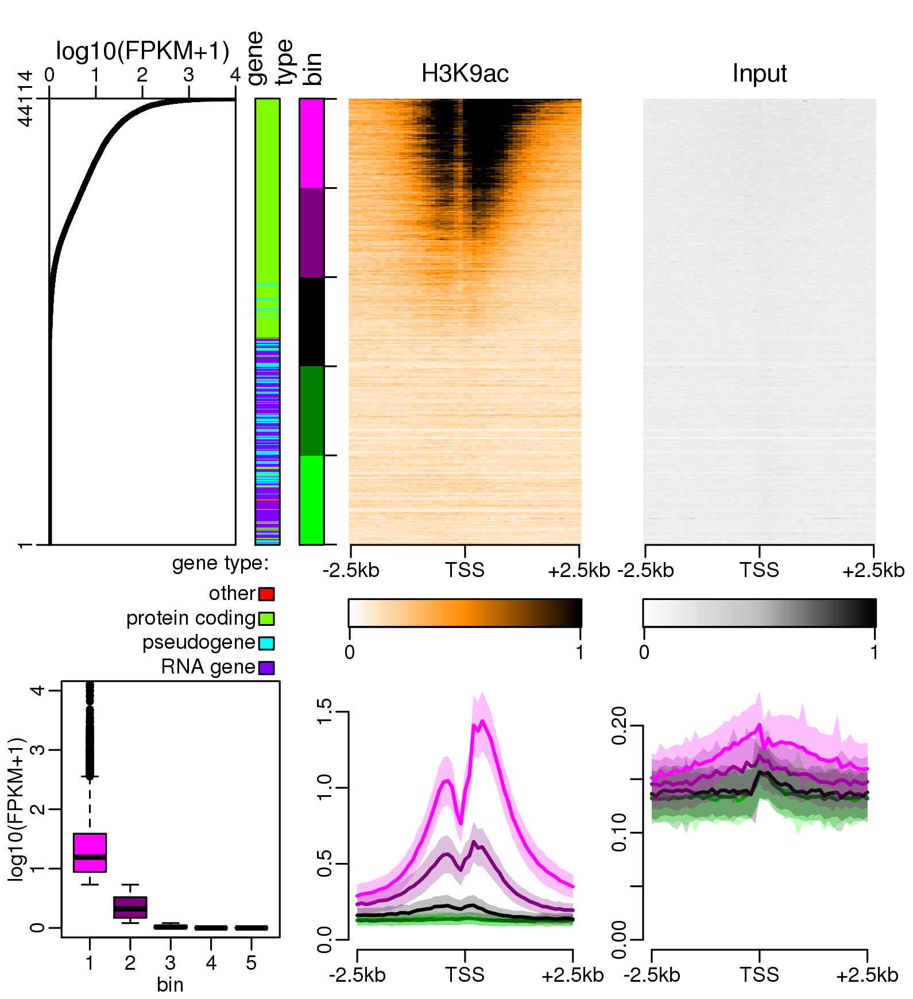
]

---
# Profile Explorer for Roadmap Epigenomics

.pull-left[
Pre-generated *stack profiles*:
- TSS, TES, middle exons

- By gene types (all, protein coding, lincRNA, pseudogenes, ...)

- WGBS, DNAse1, H2AZ, 10 histone methylations, 16 Histone acetylations

- 30 cell types (cell lines + tissues)

→ 9 921 plots so far
]
.pull-right[

]

---
# Profile Explorer for Roadmap Epigenomics

.center[
<video width="1000" height="auto" controls loop style="border: 1px solid gray;">
  <source src="vid/perepigenomics.webm" type="video/webm">
Your browser does not support the video tag.
</video> 
]

---
class: center
layout: true

---
WGBS, pancreas

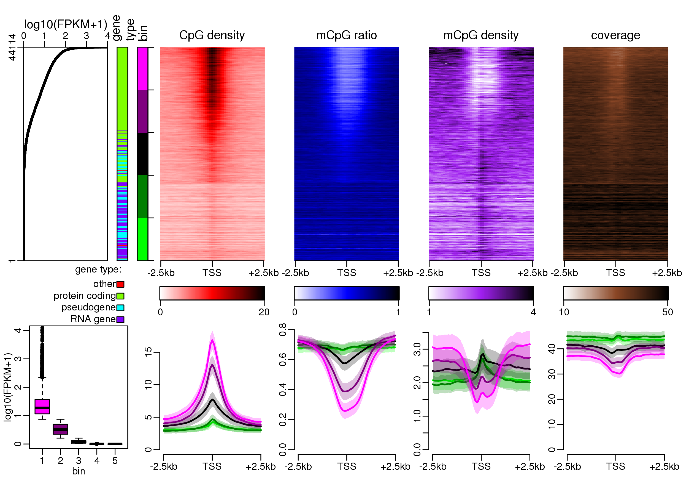

---
H3K36me3, fetal large intestine


---
layout: false
class: largetext
# Alternatives

Tools from *Blueprint Epigenome*:
- *Blueprint* data analysis portal: [blueprint-data.bsc.es/release_2016-08](http://blueprint-data.bsc.es/release_2016-08/) 

- *DeepBlue* analysis server: [deepblue.mpi-inf.mpg.de](http://deepblue.mpi-inf.mpg.de/)

- Dive (in early development): [dive.mpi-inf.mpg.de](http://dive.mpi-inf.mpg.de)

Galaxy servers, notably:
- *deepTools*: [deeptools.ie-freiburg.mpg.de](http://deeptools.ie-freiburg.mpg.de/)

- *Cistrome*: [cistrome.org/ap/root](http://cistrome.org/ap/root)

---
class: inverse, largetext

# Thanks
.pull-left[
Anagha Joshi

Anna Mantsoki

Deepti Vipin
]
.pull-right[
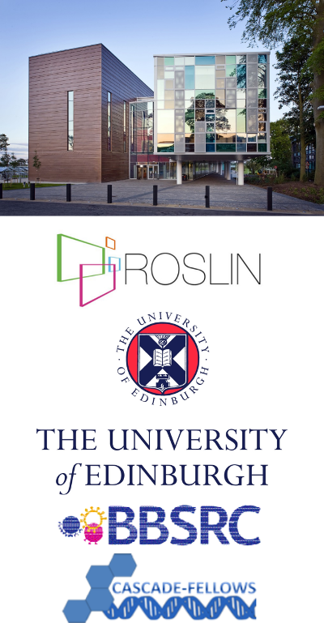

]
