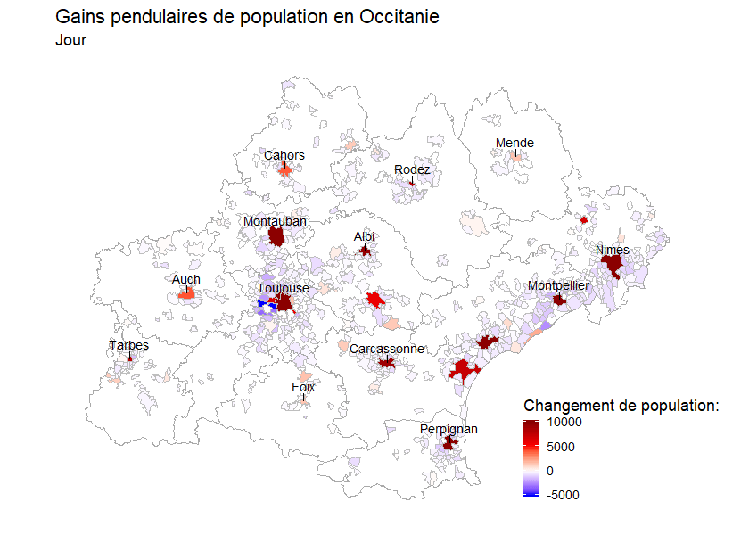

```{r setup, include=FALSE}
knitr::opts_chunk$set(echo = TRUE, warning = FALSE, message = FALSE)
```

*Analyse réalisée dans le cadre du [Hackaviz 2019](http://toulouse-dataviz.fr/hackaviz-2019-2) du groupe Toulouse Dataviz.*

---

Quelles sont les communes gagnant ou perdant des habitants lors d'une journée de travail classique ?
Une carte animée présentant les gains ou pertes de population de chaque commune permet d'en savoir plus.

```{r breathig map}
# généré par le code breathing_map.R
```


*Nous n'avons pas les données pour les communes non représentées. Les chiffres sont des sous-estimations, ils n'incluent en effet que les trajets concernant plus de 100 personnes.*

**Clefs de lectures :** Les grandes villes de la région, notament les préfectures, attirent des travailleurs le jour
tandis que les villes périphériques se vident.

Pour identifier les grands axes de déplacement, représentons chacun des trajets impliquant chaque jour plus de 100 personnes :

```{r lumieredanslanuit, fig.width=9.48, fig.height=7.5}
load("lumiere_dans_la_nuit.RData") # généré par le script lumieredanslanuit.R 
library(ggplot2)

ggplot(dest.xy, aes(oX, oY))+
    geom_segment(aes(x=oX, y=oY,xend=dX, yend=dY, alpha=trips), col="white")+
    scale_alpha_continuous(range = c(0.1, 0.4))+ ## A voir!
    theme(panel.background = element_rect(fill='#0b0b31',colour='#0b0b31'),legend.position = "none") + quiet

```


Cette animation peut être résumée sous forme d'un résaux, simplifié aux trajets impliquant plus de 600 personnes :


```{r network, fig.width=9.48}
library(visNetwork)
load("network_data.RData") # généré par le script trajets_explo.R

ledges <- data.frame(
    color = colorRampPalette(c("lightgrey", "black"))(4)[1:3],
    label = c("< 10 km", "< 20 km", "> 20 km"),
    shape = "circularImage",
    arrows = "to",
    title = "Distance :"
)
lnodes <- data.frame(
    label = c("> 100 000 ha", "> 10 000 ha", "< 10 000 ha"),
    size = c(40, 30, 20),
    color = "lightgrey",
    title = "Population :"
)
visNetwork(
    vnodes, vedges,
    main = list(
        text = "Principaux flux pendulaires en Occitanie",
        style = 'font-family:Arial;font-size:20px;text-align:center;'
        ),
    background = "#f2f2f2"
) %>%
    visPhysics(
        barnesHut = list(gravitationalConstant = -1500)
    )
```


*Le réseau peut mettre quelques secondes à s'afficher. Vous pouvez zoomer ou déplacez les points à l'aide de la souris.*

Les métropoles drainent leurs populations périphériques respectives. Blagnac se distingue par le fait que 
cette commune en périphérie de Toulouse attire un grand nombre de travailleurs. Il s'agit du principal site 
d'Airbus dans la région.

Quels facteurs permetraient d'expliquer les flux observés ? Une première hypothèse est que les grandes villes attirent
les travailleurs, tandis que les petites communes se vident en journée. Nous représentons ici le gain relatif de population
des communes d'Occitanie suite à l'arrivée ou au départ des travailleurs, c'est-à-dire le nombre net d'arrivées (arrivées - départs) divisé par la population de la commune.

```{r par_commune, dev="svglite"}
library(tidyverse)
library(ggrepel)
library(svglite)
theme_set(theme_bw(base_size = 14))

load("par_commune.RData") # généré par le script trajets_explo.R

ggplot(par_commune, aes(x = habitants, y = gain_relatif)) +
    geom_hline(yintercept = 0, linetype = "dashed", size = 1) +
    geom_point(aes(colour = pref_dep), size = 0.8) +
    geom_smooth(colour = "salmon") +
    geom_text_repel(aes(label = communes_notables)) +
    scale_x_log10() +
    scale_y_continuous(labels = scales::percent) +
    annotation_logticks(side = "b") +
    scale_colour_viridis_d(begin = 0.3, end = 0.8) +
    labs(x = "Nombre d'habitants", y = "Gains relatifs", colour = NULL, 
         title = "Changements relatifs de population pendant le jour\nen fonction de la population des communes",
         subtitle = "Un point = une commune") +
    theme(
        legend.position = c(0.88, 0.88),
        legend.background = element_rect(fill = "white", linetype = "solid", colour = "darkgray", size = 0.3)
    )
```

C'est en effet ce que nous observons, avec une transition qui s'oppère vers ~15 000 habitants. Au dessus, la commune
 attire des travailleurs, en deça, elle aura tendance à en fournir.

Quelques communes notables se distinguent sur ce graphique. Labège voit sa population plus que doubler pendant le jour. 
Blagnac gagne un grand nombre de travailleur, principalement grâce à Airbus et à l'aéroport.
Chusclan héberge une partie du [site nucléaire de Marcoule](https://fr.wikipedia.org/wiki/Site_nucl%C3%A9aire_de_Marcoule).

Un autre facteur possible d'explication de la mobilité domicile - travail serait la distance du trajet : 
peu de travailleurs sont prêts à parcrourir quotidiennement une grande distance.

```{r par_trajets, dev="svglite"}
load("mes_trajets.RData") # généré par le script trajets_explo.R
 
ggplot(travel_distance, aes(x = dist, y = n)) +
    geom_ribbon(aes(ymin = 0, ymax = n), fill = "#FF707070", aplha = 0.5) +
    geom_line(colour = "salmon", size = 2) +
    scale_y_log10() +
    scale_x_continuous(
        breaks = c(0, 25, 75, 100),
        labels = c("0", "25", "75", ">100")
    ) +
    annotation_logticks(side = "l") +
    labs(x = "Distance à vol d'oiseau (km)", y = "Nombre de travailleurs",
         title = "Distance parcouru lors des trajets\ndomicile - travail en Occitanie")

```

On retouve une relation (globalement) négative, comme attendu.
On peut essayer de prendre en compte ces deux facteurs, attractivité des grandes villes, et reluctance 
à partir loin à l'aide d'un [modèle gravitaire de flux](https://en.wikipedia.org/wiki/Gravity_model_of_migration) :

$F_{AB} = k * \frac{Pop_A*Pop_B}{dist^\alpha_{AB}}$

où le flux de travailleurs entre la ville **A** et la ville **B** est proportionel au produit du nombre d'habitants
de **A** et de **B** divisé par une puissance de la distance entre la ville **A** et **B**. *k* et $\alpha$ 
sont des paramètres que nous allons estimer à partir des données.

```{r gravity}
library(plotly)
load("data_grav.Rdata") # généré par le script trajets_explo.R

p <- ggplot(data_grav, aes(x = flux, y = flux_predit)) +
    geom_density2d() +
    geom_point(aes(text = paste(ville_A, ville_B, sep = " - "))) +
    geom_abline(intercept = 0, slope = 1) +
    scale_x_log10() +
    scale_y_log10() +
    annotation_logticks(side = "bl") +
    annotate("text", x = 8000, y = 1, label = "k=0.00012\nalpha = 1.7\nR² = 0.46", hjust = 0) +
    annotate("text", x = 8000, y = 6500, label = "droite 1:1", hjust = 0) +
    labs(x = "Flux observé (log10)", y = "Flux prédit (log10)",
         title = "Model gravitaire des déplacements domicile - travail en Occitanie",
         caption = "k=0.00012, alpha = 1.7, R² = 0.46") +
    theme_bw(base_size = 12)
plotly::ggplotly(p, tooltip = "text")
```

Le modèle gravitaire semble raisonablement bien estimer les flux de travailleurs en Occitanie, 
à partir des seules populations des communes et de leur éloignement. 
Il a légèrement tendance à sous-estimer les gros déplacements. 
On observe une variabilité importante concernant les petits déplacements.

# Outils utilisés
Le document et les visualisations ont été générées à partir de [R](https://cran.r-project.org/)
et de plusieurs paquets, notament :

* [ggplot2](https://ggplot2.tidyverse.org/) et le [tidyverse](https://www.tidyverse.org/),
* [gganimate](https://gganimate.com/),
* [sf](https://cran.r-project.org/package=sf),
* [visNetwork](http://datastorm-open.github.io/visNetwork/)
* [plotly](https://plot.ly/r/)

Les scripts utilisés sont disponibles sur [GitHub](https://github.com/gdevailly/gdevailly.github.io/tree/master/hackaviz2019).
