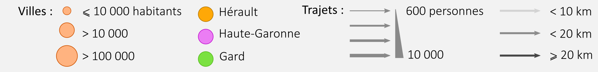

```{r setup, include=FALSE}
knitr::opts_chunk$set(echo = TRUE)
```

Analyse réalisée dans le cadre du [Hackaviz 2019](http://toulouse-dataviz.fr/hackaviz-2019-2) du groupe Toulouse Dataviz.

---

Quelles sont les communes gagnant ou perdant des habitants lors d'une journée de travaille classique ?
Une carte animé présentant les gains ou pertes de populations de chaque commune permet d'en savoir plus.


*Nous n'avons pas les données pour les communes non représentées.*
**Clefs de lectures :**Les grandes villes de la régions, Toulouse, Montpellier, Nïmes, etc. attirent des travailleurs,
tandis que les villes périphériques se vident le jour.

Pour mieux comprendre la migration pendulaire en occitanie, en identifiant les grands axes de déplacement,
représentons chaquns des trajets impliquants chaque jours plus de 100 personnes.


Et pour y voir plus claire, représentons les principaux déplacements 
(trajets concernants plus de 600 personnes par jour) sous forme d'un résaux:


```{r network, fig.width=9.48, echo=FALSE}
library(visNetwork)
load("network_data.RData")
ledges <- data.frame(
    color = colorRampPalette(c("lightgrey", "black"))(4)[1:3],
    label = c("< 10 km", "< 20 km", "> 20 km"),
    shape = "circularImage",
    arrows = "to",
    title = "Distance :"
)
lnodes <- data.frame(
    label = c("> 100 000 ha", "> 10 000 ha", "< 10 000 ha"),
    size = c(40, 30, 20),
    color = "lightgrey",
    title = "Population :"
)
visNetwork(
    vnodes, vedges,
    main = list(
        text = "Principaux flux pendulaires en Occitanie",
        style = 'font-family:Arial;font-size:20px;text-align:center;'
        ),
    background = "#f2f2f2"
) %>%
    visPhysics(
        barnesHut = list(gravitationalConstant = -1500)
    )
```


*Le réseau peut mettre quelques secondes à s'afficher. Vous pouvez zoomer ou déplacer les points à l'aide de la souris.*

# graphs emilie

# modélisation gravitationnelle yann

# Outils utilisés
Le document et les visulaisations ont été générés à partir de [R](https://cran.r-project.org/)
et de plusieurs paquets, notament 
ggplot2 et le tidyverse,
gganimate,
sf,
visNetwork
