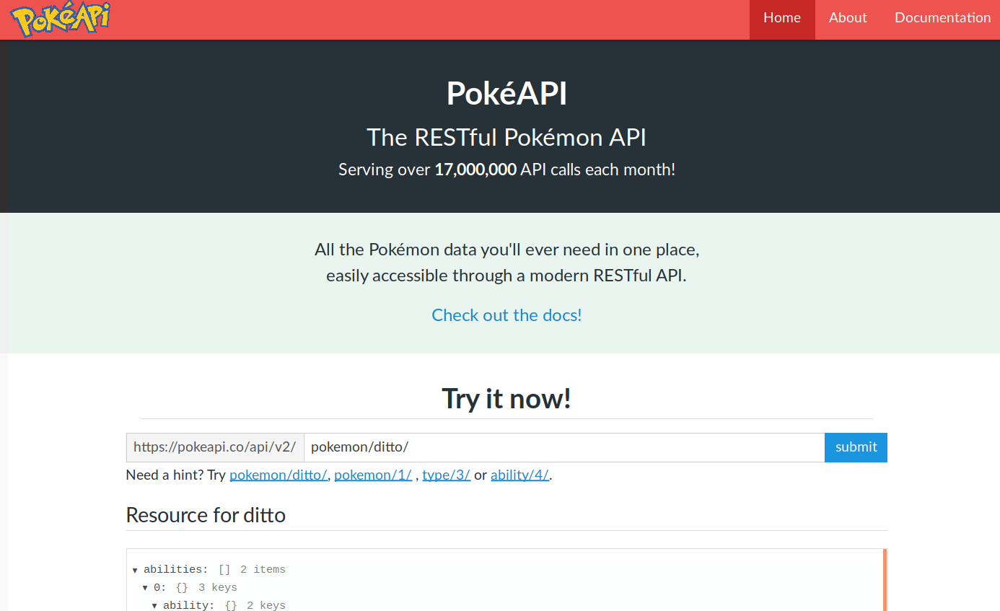

class: center

# Je veux en savoir plus sur Pikachu

```{r setup, include=FALSE}
options(htmltools.dir.version = FALSE)
library(knitr)
knitr::opts_chunk$set(
    collapse = TRUE,
    cache = TRUE
)
```

--



---

```{r, message=FALSE}
library(purrr)    # the package I'm going to present
library(jsonlite) # importing JSON data as R list
library(dplyr)    # imported for tible, pipe, etc.
```
---

```{r}
pikachu <- jsonlite::fromJSON(
    "https://pokeapi.co/api/v2/pokemon/pikachu"      
)
str(pikachu, max.level = 1)
```

---

# Quel est l'Indice de Masse Corporelle de Pikachu ?
### (imc, ou bmi en anglais)

```{r}
with(pikachu, tibble(
    name = "Pikachu",
    weight = weight/10, # API in hectograms, we want kilograms
    height = height/10, # API in decimeters, we want meters
    BMI = weight / (height^2),
    type = paste(types$type$name, collapse = ", "), # Pokemons can have several types, collapsing
    sprite = sprites$front_default
))
```

---

# Mais si je m'intéresse aussi à Bulbizarre, Salamèche et Carapuce ?

---
Solution 1 : copier, coller, modifier

```{r}
bulbasaur <- jsonlite::fromJSON(
    "https://pokeapi.co/api/v2/pokemon/bulbasaur"    
)
with(bulbasaur, tibble(
    name = "bulbasaur",
    weight = weight/10, 
    height = height/10,
    BMI = weight / (height^2),
    type = paste(types$type$name, collapse = ", "),
    sprite = sprites$front_default
))

charmander <- jsonlite::fromJSON(
    "https://pokeapi.co/api/v2/pokemon/charmander"      
)
with(charmander, tibble(
    name = "charmander",
    weight = weight/10,
    height = height/10, 
    BMI = weight / (height^2),
    type = paste(types$type$name, collapse = ", "),
    sprite = sprites$front_default
))

squirtle <- jsonlite::fromJSON(
    "https://pokeapi.co/api/v2/pokemon/squirtle"      
)
with(squirtle, tibble(
    name = "squirtle",
    weight = weight/10,
    height = height/10, 
    BMI = weight / (height^2),
    type = paste(types$type$name, collapse = ", "),
    sprite = sprites$front_default
))
```

---
Solution 1 : copier, coller, **modifier**

```{r, tidy=FALSE, }
bulbasaur <- jsonlite::fromJSON( #<<
    "https://pokeapi.co/api/v2/pokemon/bulbasaur" #<<      
)
with(bulbasaur, tibble( #<<
    name = "bulbasaur", #<<
    weight = weight/10, 
    height = height/10, 
    BMI = weight / (height^2),
    type = paste(types$type$name, collapse = ", "),
    sprite = sprites$front_default
))

charmander <- jsonlite::fromJSON( #<<
    "https://pokeapi.co/api/v2/pokemon/charmander" #<<      
)
with(charmander, tibble( #<<
    name = "charmander", #<<
    weight = weight/10, 
    height = height/10, 
    BMI = weight / (height^2),
    type = paste(types$type$name, collapse = ", "),
    sprite = sprites$front_default
))

squirtle <- jsonlite::fromJSON( #<<
    "https://pokeapi.co/api/v2/pokemon/squirtle" #<<
)
with(squirtle, tibble( #<<
    name = "squirtle", #<<
    weight = weight/10,
    height = height/10, 
    BMI = weight / (height^2),
    type = paste(types$type$name, collapse = ", "),
    sprite = sprites$front_default
))
```

---

* laborieux
* source d'erreurs
* répercuter tout changement dans chaque copier - coller

Mais les IDE peuvent aider :
* Rechercher et Remplacer
* curseurs multiples (alt + click sour RStudio)

---
Solution 2: une boucle `for`

```{r}
my_pokemons <- c("pikachu", "bulbasaur", "charmander", "squirtle")

pokemon_bmi <- tibble( # pré-allocation
    name = character(0),
    weight = double(0),
    height = double(0),
    bmi = double(0),
    type = character(0),
    sprite = character(0)
)

for (i in seq_along(my_pokemons)) {
    poke_i <-  jsonlite::fromJSON(
        paste0("https://pokeapi.co/api/v2/pokemon/", my_pokemons[i])
    ) 
    pokemon_bmi[i, ] <- with(poke_i, tibble( 
        name =  my_pokemons[i],
        weight = weight/10,
        height = height/10, 
        BMI = weight / (height^2),
        type = paste(types$type$name, collapse = ", "),
        sprite = sprites$front_default
    ))
}
```

---

```{r}
pokemon_bmi
```

* fonctionne
* rapide

Mais :
* verbeux
* crée des variables dans l'environnement global
* peut être lent si l'objet grandit : `pokemon_bmi <- rbind(pokemon_bmi, new_pokemon)`
* besoin de réfléchir pour ne pas tomber dans ce genre de piège
* non immédiatement parallélisable

---

La solution idiomatique : `lapply()`

Étape 1 : créer une fonction

```{r}
get_pokemon_bmi <- function(poke_name, sleep = 0) {
    my_pokemon <-  jsonlite::fromJSON(
        paste0("https://pokeapi.co/api/v2/pokemon/", poke_name)
    ) 
    Sys.sleep(sleep)
    return(
        with(my_pokemon, tibble( 
            name = name,
            weight = weight/10,
            height = height/10, 
            BMI = weight / (height^2),
            type = paste(types$type$name, collapse = ", "),
            sprite = sprites$front_default
        ))
    )
}
get_pokemon_bmi("pikachu")
```

---

Étape 2 : appeler la fonction sur chaque élément d'un vecteur

```{r}
my_pokemons <- c("pikachu", "bulbasaur", "charmander", "squirtle")

pokemon_bmi <- lapply(
    my_pokemons, # for each element in my_pokemons
    get_pokemon_bmi # run function get_pokemon_bmi 
)

str(pokemon_bmi) # a list :-(
```

---

Étape 3 : transformer la liste en tableau
```{r}
pokemon_bmi <- do.call(
    rbind,
    pokemon_bmi
)

pokemon_bmi
```

---

* en théorie, moins besoin de mettre les mains dans le cambouis
* en pratique, `x <- do.call(rbind, x)` ...
* force a écrire des fonctions
* facilement parallélisable :
```{r, error=TRUE}
pokemon_bmi <- parallel::mclapply(
    my_pokemons,
    get_pokemon_bmi,
    mc.cores = 8
)
```

---

Solution 4: le tidyverse

Étape 1 : définir une fonction

Étape 2 : itérer
```{r}
my_pokemons <- c("pikachu", "bulbasaur", "charmander", "squirtle")

pokemon_bmi <- map_dfr( # le résultat est un _D_ata _F_rame aggloméré par _R_angs
    my_pokemons,
    get_pokemon_bmi
)

pokemon_bmi
```

---

* moins besoin de mettre les mains dans le cambouis
* facilement parallélisable :
```{r, message=FALSE, warning=FALSE}
library(furrr)
plan(multiprocess(workers = 8))
future_map_dfr(my_pokemons, get_pokemon_bmi)
```

---

Une fonction `map_*` par type de résultat souhaité :

```{r echo=FALSE}

kable(
    tribble(
        ~`function`, ~result,
        "map()"    , "list",
        "map_chr()", "character vector",
        "map_int()", "integer vector",
        "map_dbl()", "double vector",
        "map_lgl()", "logical vector",
        "map_dfr()", "data frame, row bind",
        "map_dfc()", "data frame, col bind",
        "walk()"   , "no return (side effects)"
    ), format = "html"
)

```

---

Fonctions anonymes :

```{r}
map_dbl(my_pokemons, function(x) {
    get_pokemon_bmi(x)[["height"]]
})

map_dbl(my_pokemons, ~get_pokemon_bmi(.x)[["height"]])
```

---

Préserve les noms :

```{r}
my_pokemons

set_names(my_pokemons)

my_pokemons %>%
    map_chr(~get_pokemon_bmi(.x)[["type"]])

set_names(my_pokemons) %>%
    map_chr(~get_pokemon_bmi(.x)[["type"]])
```

---
Attrapage d'erreur :

```{r, error=TRUE}
my_pokemons <- c("pikachu", "bulbasaur", "charmander", "squirtle", "magicarpe")
map(my_pokemons, get_pokemon_bmi)
```

**Tout** le calcul est perdu à cause d'une erreur sur **une seule** itération 
(T__T)

---

```{r}
safe_get_pokemon_bmi <- safely(get_pokemon_bmi)

safe_get_pokemon_bmi("pikachu")

safe_get_pokemon_bmi("magicarpe")

```

---

```{r}
prelim_results <- set_names(my_pokemons) %>%
    map(safe_get_pokemon_bmi)

success <- map_lgl(prelim_results, ~is.null(.x$error))
success

map_dfr(prelim_results[success], "result")
```

---

Ou alors :
```{r}
possibly_get_pokemon_bmi <- possibly(get_pokemon_bmi, otherwise = NULL)

possibly_get_pokemon_bmi("pikachu")

possibly_get_pokemon_bmi("magicarpe")

my_pokemons
map_dfr(
    my_pokemons,
    ~possibly(get_pokemon_bmi, otherwise = NULL)(.x)
)
```

---

Attention : les erreurs sont devenues silencieuses !
```{r error=TRUE}
get_pokemon_bmi("magicarpe")

possibly(get_pokemon_bmi, otherwise = NULL)("magicarpe")

possibly(get_pokemon_bmi, otherwise = NULL, quiet = FALSE)("magicarpe")

```


---
Et sur 151 pokémon ?

```{r, eval=FALSE}
pokemon_bmi <- map_dfr(1:151, possibly_get_pokemon_bmi, sleep = 1)

library(ggplot2)
library(ggimage)

ggplot(pokemon_bmi, aes(x = weight, y = height, text = name)) +
    stat_function(fun = function(w) sqrt(w/30), color = "darkred", linetype = "dotted") +
    stat_function(fun = function(w) sqrt(w/15), color = "orange", linetype = "dotted") +
    annotate("text", x = rep(350, 2), y = c(3.1, 4.5), label = c("BMI = 30", "BMI = 15"), color = c("darkred", "orange")) +
    geom_image(aes(image = sprite), size = 0.12) +
    theme_bw(base_size = 14)

```

---
class: center

```{r, echo=FALSE, message=FALSE, warning=FALSE, fig.height=8, fig.width=10}
pokemon_bmi <- map_dfr(1:151, possibly_get_pokemon_bmi, sleep = 1)

library(ggplot2)
library(ggimage)

ggplot(pokemon_bmi, aes(x = weight, y = height, text = name)) +
    stat_function(fun = function(w) sqrt(w/30), color = "darkred", linetype = "dotted") +
    stat_function(fun = function(w) sqrt(w/15), color = "orange", linetype = "dotted") +
    annotate("text", x = rep(350, 2), y = c(3.1, 4.5), label = c("BMI = 30", "BMI = 15"), color = c("darkred", "orange")) +
    geom_image(aes(image = sprite), size = 0.12) +
    theme_bw(base_size = 16)

```

---
# Bonus

Vectorisez vos fonctions, plus besoin de boucles !

```{r error = TRUE}
get_pokemon_bmi(c("pikachu", "bulbasaur", "charmander", "squirtle"))

get_pokemon_bmi_v <- function(poke_names, sleep = 0) {
    map_dfr(poke_names, get_pokemon_bmi, sleep = sleep)
}

get_pokemon_bmi_v(c("pikachu", "bulbasaur", "charmander", "squirtle"))

get_pokemon_bmi_v("pikachu")
```

---

# Pour aller plus loin

- passer deux séries d'arguments : `map2(x, y, fun)`
- passer n séries d'arguments : `pmap(list(x, y, z, ...), fun)`
- exécuter sur un sous ensemble : `map_at(x, at, fun)`, `map_if(x, cond, fun)`
- composer des fonctions : `compose(fun1, fun2)`
- et plus encore !

Liens :
- [Itération de fonctions avec purrr](http://perso.ens-lyon.fr/lise.vaudor/iterer-des-fonctions-avec-purrr/)
- [Lesser known purrr tricks](https://www.brodrigues.co/blog/2017-03-24-lesser_known_purrr/)


